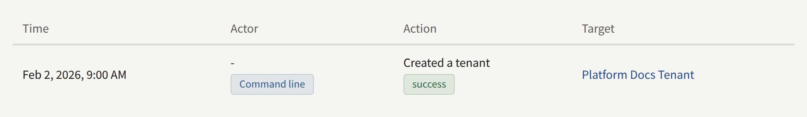
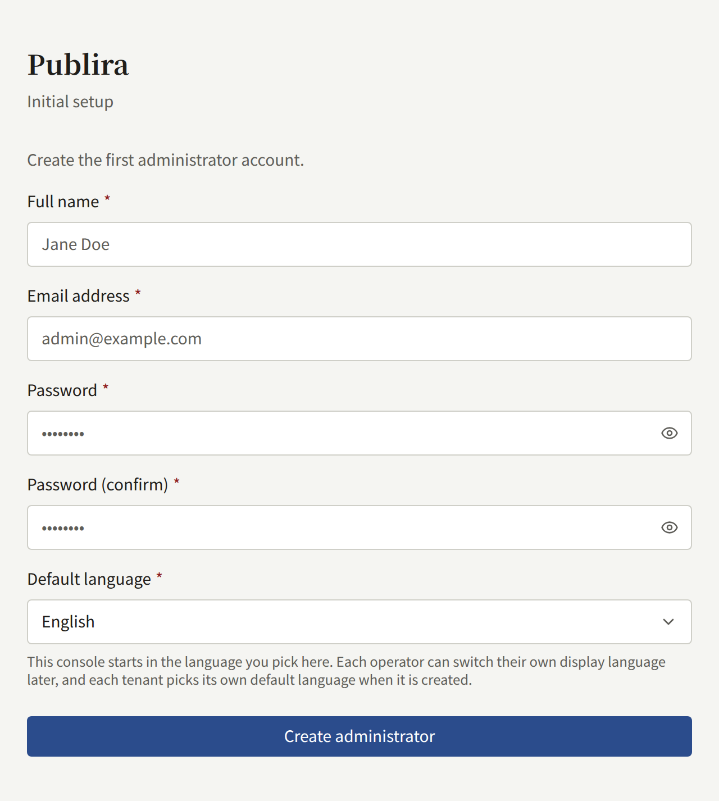
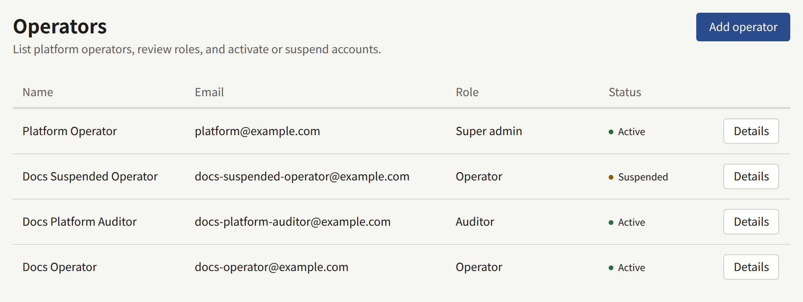
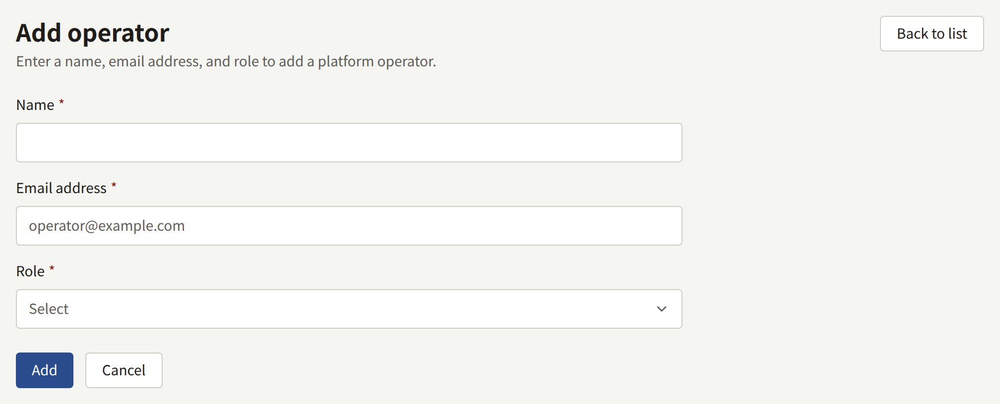
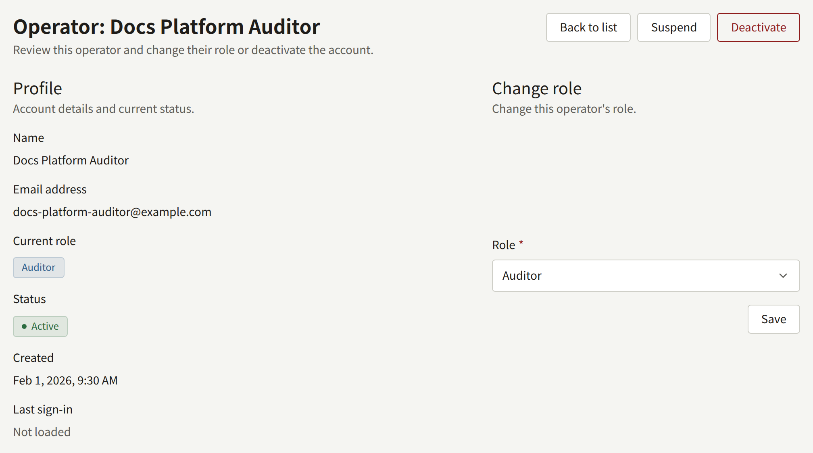
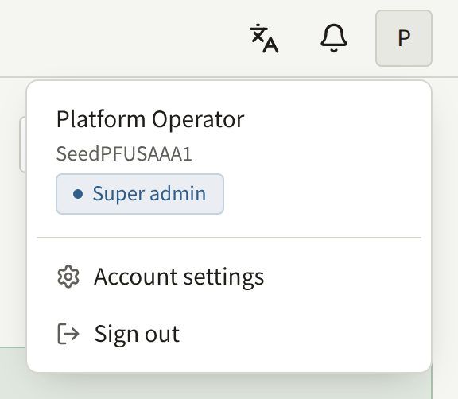
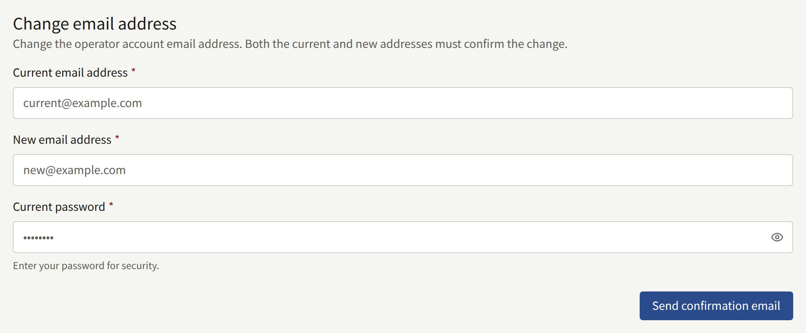
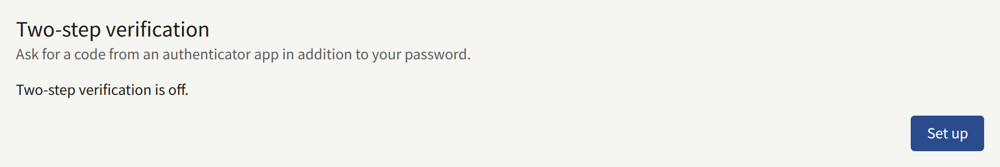
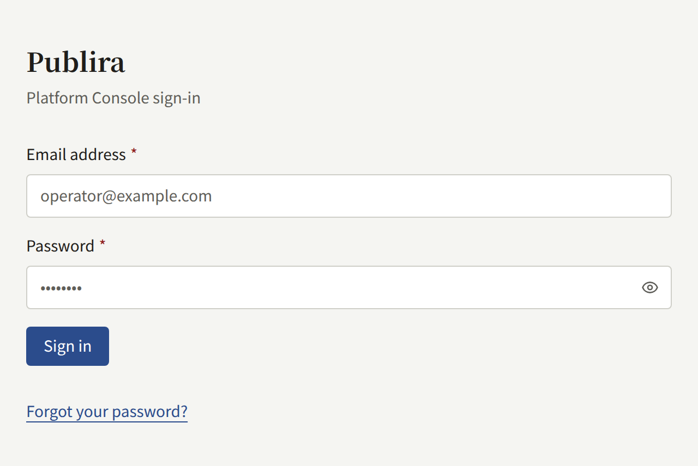

An install is managed from one of two places, and most tasks can be done from either. This page says how they differ, how the Platform Console gets its first operator, and how operators are added and given roles after that.

## Choosing between them

`publiractl` is a command you run with the image of the release the install runs, as in [Installing](../2-deployments/2-installing.md), or with `docker compose run --rm publiractl` on a [Docker Compose](../2-deployments/3-docker-compose.md) install. It connects to the database directly as `publira_platform`, so it works on an install that runs no Platform Console, and it needs nothing more than that connection: no account, no browser, and no other process running.

The Platform Console is `web-platform`, a web app operators sign in to. It has accounts of its own, each with a role, so you can let someone look at every tenant without letting them change anything, and it records which operator made each change.

Both write through the same code, so a tenant created from one is the same as a tenant created from the other, and you can use both on one install. What differs is the tasks each one offers:

| Task | `publiractl` | Platform Console |
| --- | --- | --- |
| Creating, changing, and suspending tenants | Yes | Yes |
| A tenant's members and administrator invitations | Yes | Yes |
| Creating a console account with a password, sending no mail | Yes | No |
| Platform operators | No | Yes |
| Removing an operator's lost two-step verification | Yes | No |
| The platform's defaults, policies, and retention periods | Yes | Yes |
| The readers of every tenant | No | Yes |
| Reading the audit log | No | Yes |
| Running the maintenance jobs | Yes | No |

Every change either one makes to a tenant or its staff is recorded in the Platform Console's **Audit logs**. A change made from `publiractl` names no operator there: its actor is **Command line**.



If you run no Platform Console, `publiractl` is enough to run an install. What you give up is reading the audit log and acting on readers' accounts across tenants; each tenant's administrators still manage their own readers from the tenant console.

## The first operator

Run `web-platform` as [Installing](../2-deployments/2-installing.md#the-platform-console-with-web-platform) describes, and open it. Until it has an operator, every address in it leads to the **Initial setup** screen, which asks for:

- **Full name**, **Email address**, and **Password**, with **Password (confirm)**: the first operator's account.
- **Default language**: the language the Platform Console starts in. It also becomes the platform's default language, replacing the one `publiractl setup` saved. Each operator can switch the language they see later, and each tenant picks its own when it is created.



**Create administrator** creates the account with the **Super admin** role and sends you to the sign-in screen. From then on the setup screen is gone: there is no second first operator, and nothing in `publiractl` creates an operator. Every later operator is added by a Super admin from **Operators**.

The Platform Console's accounts are its own. The tenant administrator `publiractl setup` created cannot sign in to it, and an operator cannot sign in to a tenant's console with their operator account.

## Operator roles

Each operator holds one of three roles:

| Role | What it may do |
| --- | --- |
| **Auditor** | See everything: the dashboard, tenants and their members, users, the audit log, and the platform's settings. It changes nothing but its own account |
| **Operator** | Everything an Auditor may, and change tenants, their members and invitations, readers' accounts, and the platform's settings and services |
| **Super admin** | Everything an Operator may, and add operators, change their roles, and suspend or deactivate them |

The Platform Console shows an Auditor the same screens and forms as an Operator, and refuses the change when it is submitted. The full table is in the [`publira server` reference](https://github.com/publira/publira/blob/main/server/cmd/publira/README.md#platform-console-role-permissions).

## Managing operators

**Operators**, under **Governance** in the sidebar, lists every operator with their role and status. Only a Super admin can change anything there.



### Adding an operator

**Add operator** asks for the operator's **Name**, **Email address**, and **Role**, and creates the account at once. It sends no mail, and the account's password is one nobody is told ([#3753](https://github.com/publira/publira/issues/3753)). Tell the new operator the account exists, and have them open the sign-in screen, choose **Forgot your password?**, and set a password from the link they are mailed. That mail, like every mail the Platform Console sends, is sent by `publira worker`, from the SMTP settings the platform saved.



An address that already belongs to an operator, including a deactivated one, cannot be added again.

### Changing an operator's role

Open the operator from **Operators** and choose a new role under **Change role**. Nobody can change their own role, so a Super admin can never demote themself, and the install always keeps the Super admin who is acting.



### Suspending and deactivating

On the same screen:

- **Suspend** stops the operator from signing in and ends the sessions they have open. **Reactivate** lets them sign in again.
- **Deactivate** ends the account for good. A deactivated account can never be used again, and its address cannot be added as a new operator; the changes it made stay in the audit log under its name.

Neither can be done to your own account.

## An operator's own account

**Account settings**, in the account menu of the console's header, changes your email address. A confirmation link is mailed to both the current and the new address, and the change takes effect once both have been opened.





### Two-step verification

**Two-step verification**, on the same page, asks for a code from an authenticator app each time you sign in, after your password. **Set up** shows a QR code to scan with the app, and the same key as text for an app that cannot scan; enter the six-digit code the app then shows, and choose **Turn on two-step verification**. The page then shows ten recovery codes, once: keep them somewhere safe, apart from the phone. Each one signs you in a single time while the authenticator is out of reach, wherever the sign-in asks for a code.



From then on, signing in stops after the password at **Two-step verification** and asks for the code. A sign-in with a recovery code says how many are left. While it is on, the same card has two forms:

- **Regenerate recovery codes** replaces every code you hold, used or not, with ten new ones. It takes a code from the authenticator, not a recovery code.
- **Turn off two-step verification** takes a code from the authenticator or a recovery code. You can set it up again at any time, with a new authenticator if you have one.

The platform can require it of every operator, as [Security](./12-security.md#platform-operators) describes. You are then asked to set it up the next time you sign in, and signing in finishes once you have.

There is no form that changes your password while you are signed in. Sign out, choose **Forgot your password?** on the sign-in screen, and set a new one from the link you are mailed; the link is valid for 24 hours.



### Lost two-step verification

An operator who turned on two-step verification and has since lost both the authenticator and every recovery code cannot sign in to the Platform Console, and no other operator can remove it from their account there. Remove it with `publiractl`:

```bash
publiractl operator reset-mfa --email operator@example.com
```

`--user <public ID>` names the account instead of `--email`. The command removes the account's authenticator and every recovery code, and nothing else: its password, its role, and its status stay as they were. The operator then signs in with their password alone and sets two-step verification up again from **Account settings**. If the platform requires it of every operator, the sign-in asks them to set it up before it finishes.

This is also the way back in when the operator who lost it is the install's only **Super admin**, since `publiractl` needs no account to run.

Removing it leaves the account behind its password alone, which is what someone holding a stolen password would ask for. Before you run the command, confirm that the request comes from the operator, through a channel you already know is theirs rather than the one the request arrived on.

The removal is recorded in the Platform Console's **Audit logs**, with **Command line** as the actor.
