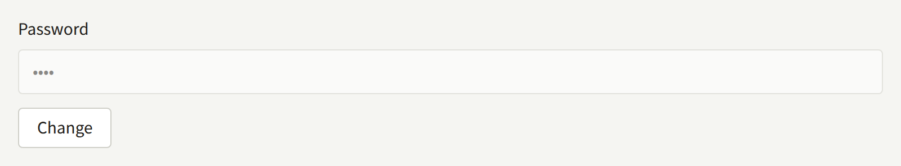
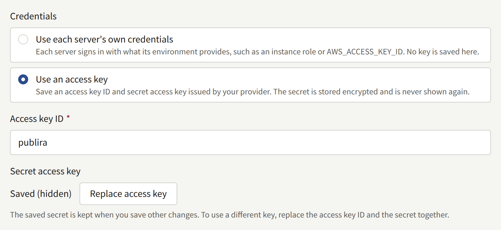
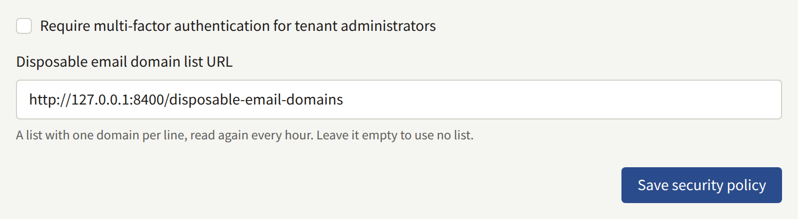

An install holds the credentials of every tenant's payment provider and mail server, the personal data of every reader, and the keys that seal them. This page is for the operator who keeps them safe: what the install relies on to keep them apart, where each secret may go, how to replace each one, and what two-step verification and the audit logs give you. Read it before you need it — each procedure below is easier to run on a quiet day than during an incident.

Generating the secrets for the first time is part of [Installing](../2-deployments/2-installing.md#generate-the-secrets), and keeping them is part of [Backup and restore](../2-deployments/6-backup-and-restore.md#the-secret-encryption-keys).

## What keeps data apart

### The database roles

No process connects to PostgreSQL as its superuser. Each part of the install connects as one of six roles that `publiractl db roles` creates, and each role reaches only what that part needs, as [The database roles](../2-deployments/2-installing.md#the-database-roles) describes. The roles that answer readers and a tenant's staff are bound by row-level security to the tenant a request names, so a defect in those paths cannot read another tenant's rows, and the operators' password hashes and the platform's mail credentials are out of reach of every role but `publira_platform` and the worker role that sends the platform's mail. The tenant console's role reads the address the platform's mail is sent from, and nothing else of the platform's mail settings.

That only holds while each process has the connection URLs of its own roles and no others. Give the superuser's password to the `publiractl db` commands alone, and never set a process's connection URL to the superuser or to a role it does not use.

### The two listeners

`publira server` listens twice. Its edge listener, port `8000`, serves the public API and the images, and is what the reverse proxy forwards to. Its internal listener, port `8100`, also serves the tenant console's and the Platform Console's APIs, and is for the web apps alone. Keep it on a network that only the web apps reach, as [Reverse proxy](../2-deployments/4-reverse-proxy.md#choose-a-sample) describes: whoever reaches it with the web service token can read every tenant's catalog and the platform's list of readers.

### Where each secret may go

Give each secret only to the processes that read it. A process that does not need a value is one more place it can leak from.

| Secret | Set it on | Never on | What its holder can do |
| --- | --- | --- | --- |
| The secret encryption keys | `publira server`, `publira worker`, `publiractl` | The web apps | Open every credential the install stores, given a copy of the database |
| The access token signing key, `PUBLIRA_AUTH_JWT_SECRET` | `publira server` | Everything else | Sign a session for any reader, member of staff, or operator |
| Each web app's session key, `PUBLIRA_AUTH_SECRET` | That web app | `publira server`, `publira worker` | Read and forge that app's session cookies, which carry the user's access token |
| The cache revalidation token | `publira server`, `publira worker`, and every web app | `publiractl` | Drop any cached page, as often as they like |
| The web service token | `publira server`, `web-admin`, `web-platform` | `web-host`, `publira worker` | Read, through the internal listener, the catalog of any tenant, unpublished series included, and the platform's tenants, operators, and readers |
| The superuser's password | The `publiractl db` commands | Every long-lived process | Everything in the database |
| Each role's password | The processes that connect as that role | The others | What that role reaches |

The web apps may share one session key, but give each its own, as the Compose file does: then replacing one signs out only that app's users.

### One set of secrets per install

Generate a fresh set of every secret for each install: production, staging, and every developer's machine. Two installs that share the access token signing key accept each other's sessions for any account whose ID exists in both, which a staging database restored from a production backup has for every account.

A copy restored from production can read its stored credentials only with production's encryption keys, and with them it holds production's SMTP account, payment provider keys, and every other credential its tenants saved. Run such a copy only where production's own secrets are allowed, and give it its own access token signing key, session keys, tokens, and role passwords.

## Rotating the secret encryption keys

Every credential the install stores is sealed with the encryption keys, and each sealed value names the key that sealed it. `PUBLIRA_SECRET_ENCRYPTION_KEYS` lists every key a process can open values with, and `PUBLIRA_SECRET_ENCRYPTION_PRIMARY_KEY_ID` names the one it seals new values with. Rotating means adding a key, sealing with it, and moving the stored values onto it; a value whose key is no longer in the list cannot be opened at all.

### 1. Add the new key

Generate a key and give it an ID the list does not hold yet, such as `k2`. Add it beside the old one, and leave the primary key as it is:

```text
PUBLIRA_SECRET_ENCRYPTION_KEYS=k1:<old key>,k2:<new key>
PUBLIRA_SECRET_ENCRYPTION_PRIMARY_KEY_ID=k1
```

Restart `publira server` and `publira worker` with it, and use it for every later `publiractl` command. Keep the new key in your secret store and with your backups at once: from the next step on, values are sealed with it.

### 2. Make it the primary key

Once every process runs with both keys, change the primary key to `k2` and restart them again. Every value saved from then on is sealed with `k2`, and every value sealed with `k1` still opens.

The two restarts are separate on purpose. A process that does not have `k2` yet cannot open a value another process has already sealed with it, so while `publira server` or `publira worker` runs more than one instance, or restarts one after the other, switching the primary key in the same step leaves a window in which mail fails or a sign-in is refused.

On a [Docker Compose](../2-deployments/3-docker-compose.md) install, each step is an edit to the two variables in `.env` followed by `docker compose up -d`, which restarts `server` and `worker` and leaves the rest running.

### 3. Seal the stored values again

Run `publiractl db reseal` on the superuser connection, with the same two variables the processes now have:

```bash
publiractl db reseal
```

It opens every sealed value in the database with the keys in the list and seals each one that names a key other than the primary again with the primary key: the platform's and every tenant's credentials, the two-step verification secret of every member of staff and operator, the token each Sign in with Apple link holds, the Web Push private key, and the ones that outbox entries carry to the worker. The values themselves stay the same, so nobody is signed out and nobody has to enter anything again, and the install keeps serving while it runs: a save that arrives meanwhile waits for it, or it for the save, and neither is lost.

It prints one line per key ID that a stored value names:

```text
KEY ID        RESEALED  ON PRIMARY  UNREADABLE
k1            42        0           0
k2 (primary)  0         3           0
```

`RESEALED` counts the values that key had sealed and the primary key now seals, `ON PRIMARY` the values the primary key had sealed already, and `UNREADABLE` the values no key in the list opens. To see the same table without writing anything, run `publiractl db reseal --dry-run`.

On a [Docker Compose](../2-deployments/3-docker-compose.md) install, the `publiractl` service already has the superuser connection and the keys from `.env`:

```bash
docker compose run --rm publiractl db reseal
```

### 4. Remove the old key only when nothing uses it

Remove `k1` from the list only when `db reseal` exits `0`, with no value left in the `UNREADABLE` column. Running it again then prints a single line for the primary key, and every value it counts opens without `k1`.

When a value no key in the list opens, `db reseal` leaves it as it is, seals every other value, and exits `1`. Its log names each such value, with its column, its row, and the key ID it names, and the table counts it under that key ID. The value was sealed with a key that is no longer in the list, or with other key material under the same ID: put that key back in the list and run the command again. A value nobody holds the key to any more has to be entered again where it was saved, as a lost key requires.

A value whose key is gone cannot be opened: with `k1` removed while a Tenant admin's authenticator secret was still sealed with it, that administrator's sign-in fails at the two-step verification step with an error page, the server logs `secretcrypto: unknown key id: k1`, and the tenant's audit log records a failed **Two-step verification at sign-in** with the reason `secret_undecryptable`. Mail that needs a password sealed with the missing key is not sent either. Putting the key back in the list, and restarting, undoes all of it.

When a key has leaked, sealing again is not enough. Whoever holds the old key and any database backup taken before the rotation can open every value in that backup, so replace the credentials themselves where they were issued — a new SMTP password, a new access key for the bucket, new payment provider keys — and save the new ones. In the Platform Console, a new SMTP password is entered with **Change** beside **Password** under **Email**, and a new access key with **Replace access key** under **Storage**, as [Email](./6-email.md#changing-it) and [Object storage](./5-object-storage.md#rotating-the-access-key) describe.





## Rotating a database role's password

A role has one password at a time, so a rotation is the change in PostgreSQL followed promptly by a restart of every process that connects as the role:

| Role | Connected to by |
| --- | --- |
| `publira_public`, `publira_admin` | `publira server` |
| `publira_platform` | `publira server`, and `publiractl` commands that change platform settings |
| `publira_outbox`, `publira_ticker` | `publira worker` |
| `publira_content_stats` | `publira worker`, and `publiractl job` |

1. Generate a new password with `openssl rand -hex 32`. Connection URLs carry it unescaped, which is why it is hex.
2. Run `publiractl db roles` on the superuser connection with that role's flag alone. Every other role keeps its password:

   ```bash
   publiractl db roles --admin-password-file /run/secrets/publira-admin-db-password
   ```

   It prints one line per role, `set its password` for the one you gave and `kept its password` for the others.

3. Change the connection URL of every process in the table above to the new password, and restart them.

Connections a process already has open stay signed in, so nothing fails the moment the password changes. Any connection it opens after that is refused, so do not leave a gap between the two steps. A process that restarts with the old password does not start at all: its log repeats `password authentication failed for user "publira_admin"`, and once it is running again, its `GET /readyz` names one check per role, so a mismatch is named there. Running `db roles` again with the password the process has puts it right.

To rotate every role at once, give `db roles` all six flags and restart `publira server` and `publira worker`.

On a Docker Compose install, the passwords are the `PUBLIRA_*_DB_PASSWORD` variables in `.env`, and the Compose file builds every connection URL from them. Change the variable, then:

```bash
docker compose run --rm publiractl db roles --admin-password-file /run/secrets/admin-db-password
docker compose up -d
```

`docker compose up -d` restarts only the processes whose connection URLs changed.

### The superuser's password

`publiractl` does not manage the superuser. Change its password in PostgreSQL, with `ALTER ROLE postgres PASSWORD '<new password>'` in `psql` or through your database provider, and then the `PUBLIRA_DB_URL` you run the `db` commands with. No long-lived process uses it, so nothing restarts.

On a Docker Compose install, PostgreSQL reads `PUBLIRA_POSTGRES_PASSWORD` only when it creates its volume, so changing `.env` alone changes nothing. Run `ALTER ROLE` with `docker compose exec postgres psql -U postgres -d publira`, then set the same value in `.env`. The next `docker compose up -d` restarts the `postgres` container, since its variables changed, which interrupts every process for a few seconds.

## Rotating the signing keys and tokens

These values are read when a process starts. Rotating one is a matter of giving every process that holds it the new value and restarting them together; none of them is stored in the database, and none has to be kept once replaced.

| Value | Change it on | What the change does |
| --- | --- | --- |
| `PUBLIRA_AUTH_JWT_SECRET` | `publira server` | Signs everyone out: readers on every tenant's site and in its mobile app, staff in every tenant console, and operators in the Platform Console |
| `PUBLIRA_AUTH_SECRET` of one web app | That web app | Signs out the users of that app alone |
| The cache revalidation token | `publira server`, `publira worker`, and every web app | Signs nobody out |
| The web service token | `publira server`, `web-admin`, and `web-platform` | Signs nobody out |

On a Docker Compose install, the variables are `PUBLIRA_AUTH_JWT_SECRET`, `PUBLIRA_WEB_HOST_AUTH_SECRET`, `PUBLIRA_WEB_ADMIN_AUTH_SECRET`, `PUBLIRA_WEB_PLATFORM_AUTH_SECRET`, `PUBLIRA_REVALIDATE_TOKEN`, and `PUBLIRA_WEB_SERVICE_TOKEN` in `.env`. Change one, and `docker compose up -d` restarts exactly the processes that read it.

### The access token signing key

Every session is an access token signed with this key, so a new key ends them all at once. A reader or a member of staff who opens a page is sent to the sign-in screen with "Your session has expired. Please sign in again." The session of a tenant's mobile app is the same kind of token, so it ends too. A member of staff halfway through a two-step verification sign-in starts again from the password.

The links to an episode's images carry a short-lived token signed with the same key. A tenant's site keeps the page of a free episode cached for up to an hour, links included, so a free episode's images can fail to load until that page is rebuilt.

Rotate it whenever it may have leaked, and whenever a session key has: a session cookie carries an access token that stays valid for a day, and only a new signing key ends it sooner.

### A web app's session key

Each web app seals its session cookie with its own `PUBLIRA_AUTH_SECRET`. A new key makes every cookie it sealed unreadable, so its users land on the sign-in screen, without a message, while the other apps keep their sessions. Rotating the key of `web-host` signs readers out of the site but not out of the mobile app, and cancels a Sign in with Apple or Google that was under way; rotating the key of `web-admin` also cancels a two-step verification sign-in that was under way.

The value has to be at least 32 bytes, and only its first 32 bytes are used, so generate a whole new one with `openssl rand -base64 32` rather than editing the end of the old one.

### The cache revalidation token

`publira server` and `publira worker` send it with every request to drop a web app's cached pages, and each web app refuses a request whose token does not match its own. While the two sides disagree, every drop is refused with `401`, and the worker logs each attempt as `outbox event retry scheduled` with `revalidate endpoint returned status=401`. The worker keeps trying each drop for about nine minutes, so restarting every process with the new token within that time loses nothing; a drop that runs out of attempts leaves the pages it named as they were, as [Scheduled and maintenance jobs](./10-scheduled-jobs.md#seeing-what-was-given-up) describes.

### The web service token

`web-admin` and `web-platform` send it to read what every member of their staff sees alike. While `publira server` holds a different one, those reads are refused, and both consoles show "Your session is no longer valid. Please sign in again." on their dashboards. Signing in again does not help: restart all three with the same token.

## Two-step verification

### Tenant staff

Every member of a tenant's staff can protect their console account with an authenticator app and ten recovery codes, from **Account settings** in the console, as [Your account](../4-console/3-setup/8-your-account.md) describes for them.

You can require it of every Tenant admin on the install: tick **Require multi-factor authentication for tenant administrators** on **Security**, under **Policies** in the Platform Console, and choose **Save security policy**, or run:

```bash
publiractl policy set --mfa-required-for-tenant-admin
```



`--mfa-required-for-tenant-admin=false` stops requiring it. The requirement is checked when a Tenant admin signs in, so it applies from each one's next sign-in rather than to sessions already open; what it does, and whom it covers, is in [Platform defaults and policies](./9-platform-policies.md#two-step-verification-for-tenant-administrators).

A member of staff who has lost both the authenticator and every recovery code cannot sign in again, and the tenant's other administrators cannot remove it from their account. You can, with `publiractl tenant member reset-mfa`, as [A tenant's staff](./3-tenant-staff.md#lost-two-step-verification) describes.

Each authenticator's secret is sealed with the encryption keys, which is why [removing an old key](#4-remove-the-old-key-only-when-nothing-uses-it) can lock staff out.

### Platform operators

Operators sign in to the Platform Console with a password alone: it offers no two-step verification yet ([#3834](https://github.com/publira/publira/issues/3834)). How often a password may be tried is limited, as [Sign-in attempts](./9-platform-policies.md#sign-in-attempts) describes, but a limit only slows guessing down. Until two-step verification is offered:

- Give each operator a long password of their own, kept in a password manager.
- Give the **Super admin** role to as few operators as you can, and **Auditor** to anyone who only needs to look.
- Suspend or deactivate an operator who no longer needs the account, as [Suspending and deactivating](./1-platform-console.md#suspending-and-deactivating) describes.
- Consider serving the Platform Console's host name only to a network your operators reach, such as through a VPN or an address allowlist at your TLS terminator. Readers and tenant staff never need it.

## Audit logs

An install keeps two audit logs that never share entries: the Platform Console's, for what operators and `publiractl` change, and each tenant's, for what its staff change in the tenant console. Entries are never deleted, and neither log can be exported.

### The Platform Console's log

**Audit logs**, under **Governance** in the Platform Console, lists the newest entries first, 20 to a page. Every operator can read it, an **Auditor** included. Each entry shows the **Time**, the **Actor** with their role, the action with its outcome, and the **Target**. A change made from `publiractl` names no operator: its actor is **Command line**. The list can be narrowed to one actor by public ID and to one kind of action, but not to a date. **View audit logs** on a tenant's page opens it narrowed to that tenant as well: the entries that changed the tenant, its admin invitations, or the accounts of its staff and readers. The tenant is named above the list, and its close button drops that filter alone; **Clear** drops every filter.


It records:

- **Operators**: added, changed, suspended, reactivated, and deactivated.
- **Platform settings and services**: each save of the general settings, the security and community policy, the retention defaults, the email, storage, and search settings, and the Web Push contact, and each test of the email, storage, and search connections, with its outcome.
- **Tenants and their staff**: tenants created, changed, suspended, and resumed; administrators invited, and invitations resent and canceled; members added, created with a password, given a new role, and removed.
- **Readers**: accounts suspended, restored, and deleted by an operator.

### A tenant's log

Each tenant's **Audit logs**, under **Administration** in its console, records what its staff do there, two-step verification included, and only its Tenant admins can read it. What it records is in [Audit log](../4-console/3-setup/7-audit-log.md). It cannot be read from the Platform Console, and what you change for a tenant from the Platform Console or `publiractl` is recorded in the Platform Console's log, not the tenant's.

### What neither log records

- **Signing in with a password.** Neither a successful sign-in nor a wrong password leaves an entry; a tenant's log records only the two-step verification step that follows. `publira server` logs every attempt to sign in to the site, a tenant console, or the Platform Console as a line beginning `audit auth`, with the action, the outcome, the reason, and the client address, such as `audit auth action=admin_login outcome=failure ... reason=invalid_credentials`. Keep the server's log if you need that record.
- **The install's secrets and variables.** Rotating a key, a password, or a token happens outside Publira and leaves no entry anywhere. Keep your own record of when you rotated what.

Every entry is also written to the log of `publira server` as a line with `msg=audit`, before it is stored. Most entries are stored a moment after the change, from a queue in the server's memory, and an entry that cannot be stored after a few attempts, or that is still queued when the server stops, is dropped from the console's list but stays in that log line. [Monitoring](./11-monitoring.md#the-audit-log) names the log lines and metrics to alert on for those drops.

## Reporting a vulnerability

A vulnerability in Publira itself is reported privately, as the [security policy](https://github.com/publira/publira/security/policy) describes, never in a public Issue.
