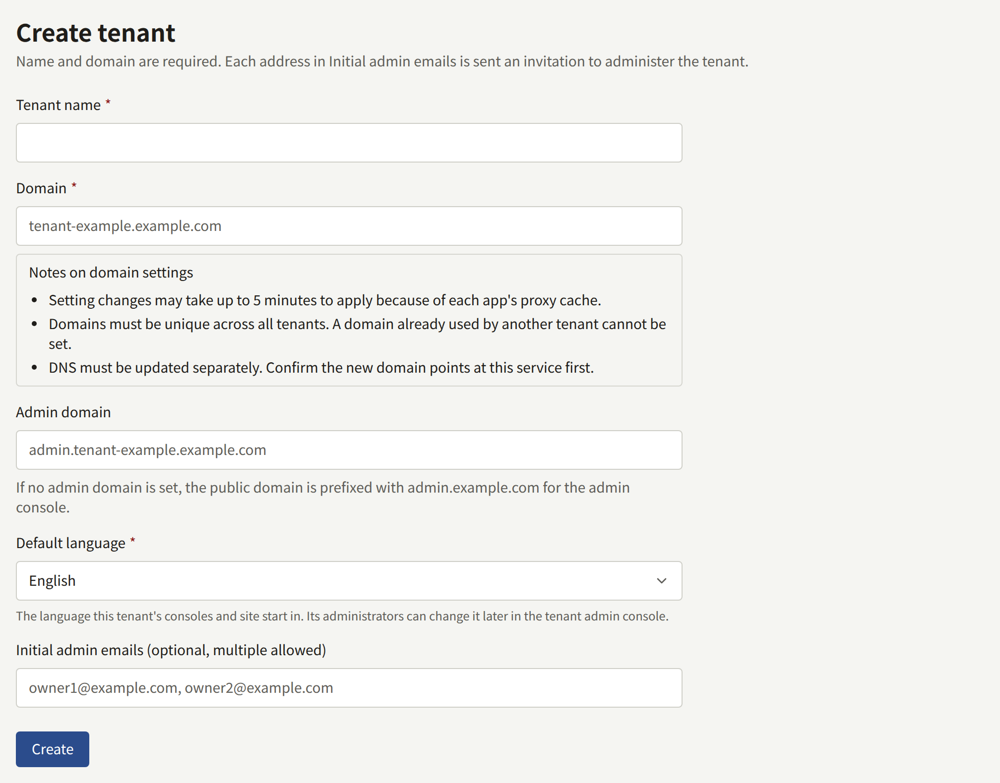
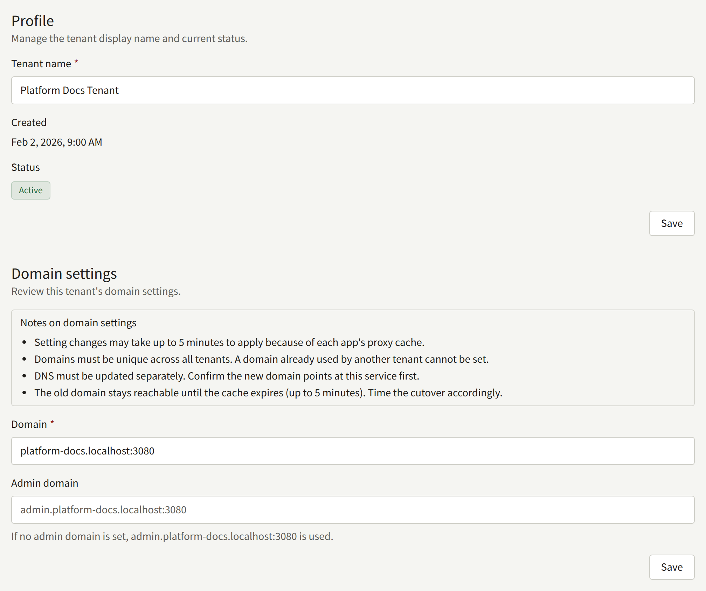
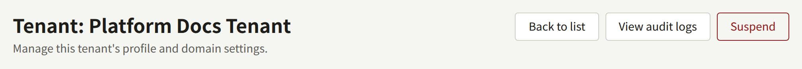
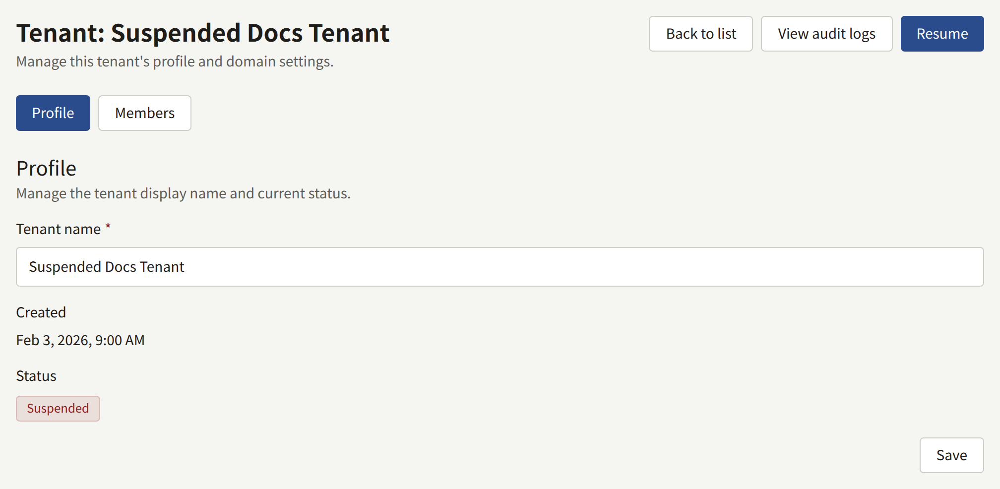
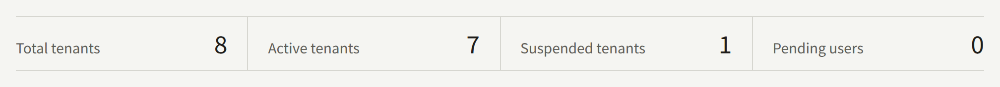

Each publisher an install serves is a tenant, with a public site on its own domain and a console on a second host name. `publiractl setup` created the first one. This page adds the next, and covers what can be changed about a tenant afterwards.

Every `publiractl` command here is shown bare; run it the way [The Platform Console and publiractl](./1-platform-console.md#choosing-between-them) describes, with `PUBLIRA_PLATFORM_DB_URL` set to the `publira_platform` connection. Its full list of flags is in the [`publiractl` reference](https://github.com/publira/publira/blob/main/server/cmd/publiractl/README.md#tenant).

## Before you create a tenant

Decide these first, since the tenant is served on its host names from the moment it exists:

- **Its domain**, the host its public site is served on, such as `comics.example.com`.
- **Its console host**, the host its staff sign in on. Unless you give it one of its own, it is `admin.` followed by the domain, such as `admin.comics.example.com`.
- **Its default language**, which its site and console start in. Nothing picks one for it. Its administrators can change it later from the tenant console.
- **Its first administrator**, and how they get access: an invitation mailed to them, or an account you create with a password. [A tenant's staff](./3-tenant-staff.md) compares the two.

Write each host name alone and in lowercase: no `https://`, no path, and no trailing `/`. Each host name belongs to one tenant, as its domain or as its console host, never both: the proxy sends a host name to one app, so a name used twice would leave one of the two unreachable. Publira refuses a domain or console host that another tenant already uses as either, the `admin.<domain>` a console is given by default included, and a console host equal to the tenant's own domain. When the `admin.<domain>` a tenant would be given is already taken, give it an admin domain of its own.

Then make both host names reach the install, in the order [Adding a tenant](../2-deployments/4-reverse-proxy.md#adding-a-tenant) gives: DNS, certificates, and the proxy's routing. You can do this before or after creating the tenant, but its staff cannot open the console until it is done.

## Creating a tenant

### From the Platform Console

Choose **Create tenant** under **Tenants** in the sidebar, and fill in:

- **Tenant name**: the publisher's name, which the invitations and the rest of the tenant's mail call it by.
- **Domain**: the domain you chose.
- **Admin domain**: the console host, only when it is not `admin.<domain>`. Left empty, the console is served on `admin.<domain>`, as the line under the field shows.
- **Default language**.
- **Initial admin emails (optional, multiple allowed)**: the addresses to invite as the tenant's administrators, separated by commas or line breaks. Each one is mailed an invitation as soon as the tenant is created.



**Create** creates the tenant and opens its page. Its time zone is the platform's default, which its administrators can change from the tenant console.

### From publiractl

```bash
publiractl tenant create \
  --name "Example Comics" \
  --domain comics.example.com \
  --default-locale en \
  --initial-admin-email owner@comics.example.com
```

`--admin-domain` gives the console a host of its own, and `--timezone` an IANA time zone other than the platform's default. `--initial-admin-email` can be repeated, and each address is invited as it would be from the Platform Console.

### After creating it

The invitations are mailed by `publira worker`, which has to be running, with the platform's SMTP settings saved. An install that sends no mail gives the tenant its first administrator with `publiractl tenant admin create` instead, as [A tenant's staff](./3-tenant-staff.md#creating-an-account-without-mail) describes.

Once an administrator has signed in, the rest of the tenant's setup — its site, branding, payments, and other staff — is done from its console.

## Changing a tenant

A tenant's name, domain, and console host can be changed after it is created. Its language and time zone belong to its administrators, who change them from the tenant console. A tenant cannot be deleted.

### From the Platform Console

Open the tenant from **Tenants**. **Profile** changes its **Tenant name**, and **Domain settings** changes its **Domain** and **Admin domain**. Emptying **Admin domain** moves the console back to `admin.<domain>`.



### From publiractl

```bash
publiractl tenant update --tenant comics.example.com --name "Example Comics Ltd."
```

`--tenant` names the tenant by its domain or its public ID. Each of `--name`, `--domain`, and `--admin-domain` replaces only that value and keeps the rest, and `--admin-domain ""` moves the console back to `admin.<domain>`. `publiractl tenant show --tenant comics.example.com` prints the tenant as it is now.

### Moving a tenant to another host name

Each web app keeps the host names it has looked up for up to five minutes, so a new domain or console host takes that long to answer everywhere, and the old one keeps answering until then. Follow the order in [Adding a tenant](../2-deployments/4-reverse-proxy.md#adding-a-tenant): put the new name in DNS, the certificates, and the routing before the change, and take the old one out once the change has taken effect. A tenant with no admin domain of its own has its console on `admin.<domain>`, so moving its domain moves its console too, and both new names have to be ready.

Moving the domain also moves everything built on it:

- Readers and staff are signed in on one host name, so they sign in again on the new one.
- The tenant's mobile app is built for one host, and opens links only on that host. Build and submit it again with the new host in its [app manifest](../5-mobile-app/1-app-manifest.md).
- The **Webhook URL** the tenant console shows for payments, and the return URLs it shows for sign-in with Apple and Google, are on the domain. Register the new ones with each provider.
- Mail sent before the change links to the old host.

## Suspending a tenant

**Suspend** on a tenant's page in the Platform Console, or `publiractl tenant suspend --tenant comics.example.com`, marks the tenant **Suspended**. **Resume**, or `publiractl tenant resume`, marks it active again. The Platform Console's button takes effect as soon as it is pressed, with no confirmation. Either way the change is recorded in **Audit logs**, and the dashboard counts the tenant among its **Suspended tenants**.







Suspension stops serving the tenant, and changes nothing else about it:

- Its site, its app, and its console stop working. The API refuses every request for the tenant, signing in included, and its images are no longer served. Images a reader's browser, or a cache in front of Publira, already holds stay visible for up to an hour, which is how long Publira lets them be kept.
- Readers see that the site is unavailable, and nothing more. Every page of the site answers with one saying so, with the status `503`, which tells search engines that the site is away for a while rather than gone. The app shows the same in place of every screen, with **Retry**, and opens again once the tenant is resumed and the reader taps it or comes back to the app.
- Staff see that the console is unavailable because the site is suspended, on every page of the console, its sign-in page included. Nothing on it names an internal detail.
- The web apps keep the host names they have looked up for up to five minutes. For that long after the suspension, a page they had already prepared can still be shown, and any other shows the apps' error page in place of the pages above.
- The notifications its payment providers and its inbound mail provider send are refused as well. Each provider retries a refused notification on its own schedule, so one it is still retrying when the tenant is resumed is processed then, and one it has given up on is not.
- Readers and staff stay signed in. Their sessions are not honoured while the tenant is suspended, and work again once it is resumed.
- Mail and push notifications to its readers and staff are not sent, and are not kept to send later: what they link to is unavailable, and by the time the tenant is resumed they would be out of date. An invitation to administer the tenant, which you send from the Platform Console or `publiractl`, is the exception and goes out; its link works once the tenant is resumed, and **Resend** issues a new one if it has expired by then.
- Its scheduled publications, free reading periods, royalty closing, and the rest of its scheduled work carry on, so a resumed tenant is where its own schedule would have put it.
- Its details, members, and invitations can still be changed from the Platform Console and `publiractl`, as [A tenant's staff](./3-tenant-staff.md) describes.

Nothing about the tenant is deleted or changed by suspending it or resuming it, and resuming it serves it again at once, with nothing else to do.
