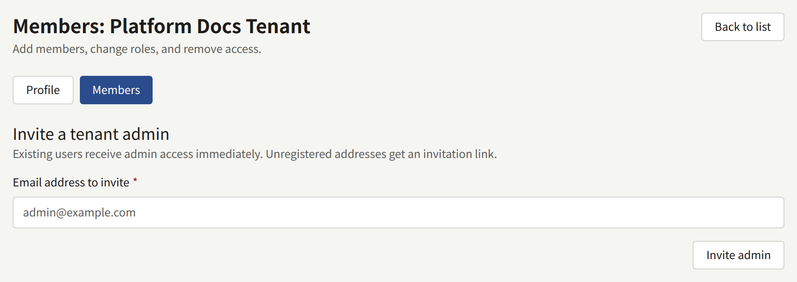
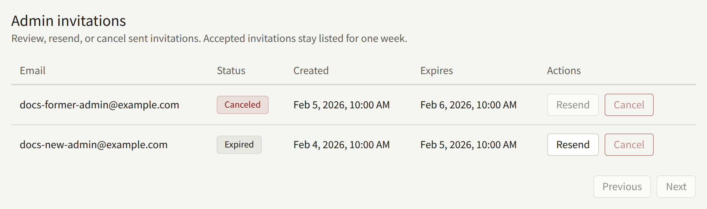
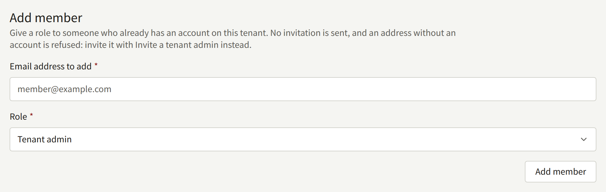
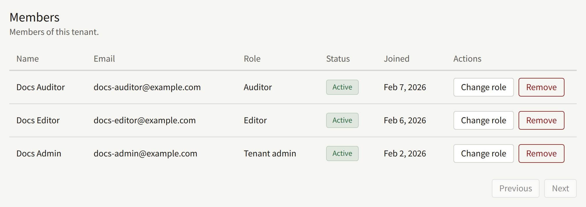

A tenant's staff are the people who sign in to its console. This page covers how they get there from the operator's side: inviting the first administrator, the roles staff hold, and what to do when a tenant has no administrator left. Once a tenant has an administrator, that administrator manages the rest of the staff from **Members** in the tenant console, as [Members](../4-console/3-setup/5-members.md) describes, and the operator is needed again only when something goes wrong.

The `publiractl` commands here are run as on [The Platform Console and publiractl](./1-platform-console.md#choosing-between-them), and every one of them names its tenant with `--tenant`, by domain or by public ID. Their full list of flags is in the [`publiractl` reference](https://github.com/publira/publira/blob/main/server/cmd/publiractl/README.md#tenant).

## Members and users

Every account belongs to one tenant: a reader who signs up on two tenants' sites has two accounts, one in each. An account is a **user** of its tenant. A user who also holds a console role is a **member** of the tenant's staff, and can sign in to its console.

Two things follow from this:

- Making someone staff never moves their account. A reader of the tenant who is given a role signs in to the console with the address and password they already read with.
- Taking someone's role away keeps their account. They stay a reader of the tenant, and can be given a role again later.

## The three roles

| Role | What it may do |
| --- | --- |
| **Tenant admin** | Everything in the console: the staff and their invitations, every setting of the tenant, its site and branding, the mail, payment, push notification, and sign-in integrations, readers' accounts and contact messages, access tickets, royalties, and the audit log |
| **Editor** | Write the catalog — series, episodes, Authors, labels, genres — and the tenant's pages and announcements, and moderate comments |
| **Auditor** | See what an Editor works on, and the tenant's settings, without changing any of it |

Each role includes everything the roles below it may do. The console hides what a role may not use: an Editor sees no **Members**, **Readers**, or **Royalties** in its sidebar, and an Auditor sees no button that changes anything.

A tenant needs at least one Tenant admin, since only a Tenant admin can give anyone else a role.

## Giving staff access

There are three ways, and which one fits depends on whether the person already has an account in the tenant, and whether the install sends mail.

### Inviting a Tenant admin

An invitation is mailed to an address and makes it a Tenant admin when accepted. It is how a new tenant usually gets its first administrator, through the addresses given when it was created, and how more are added later.

- **Platform Console**: open the tenant from **Tenants**, choose **Members**, enter the address under **Invite a tenant admin**, and choose **Invite admin**.
- **publiractl**: `publiractl tenant invite create --tenant comics.example.com --email editor-in-chief@comics.example.com`



The invitee is mailed a link to the tenant's console, in the tenant's default language. On it they enter their **Full name** and a **Password**, choose **Accept invitation**, and sign in. The link is valid for 24 hours.

An address that already belongs to a user of the tenant is not invited: it becomes a Tenant admin at once, and no mail is sent. This replaces any role it held before, so an Editor invited this way becomes a Tenant admin.

The invitation mail is sent by `publira worker`, from the tenant's own SMTP settings if it has saved some, and from the platform's otherwise. An install with no worker running creates the invitation and sends nothing.

An invitation sent from the Platform Console or `publiractl` can only make a Tenant admin. Editors and Auditors are given their role as described in [Adding an existing user](#adding-an-existing-user), or are invited by one of the tenant's own administrators, whose console lets an invitation grant any of the three roles.

### Following an invitation up

**Admin invitations**, on the same **Members** screen, lists each invitation as **Pending**, **Accepted**, **Canceled**, or **Expired**.

- **Resend**, on a pending or an expired invitation, mails it again with a new link, valid for another 24 hours. The previous link stops working.
- **Cancel**, on a pending invitation, withdraws it, and its link stops working.



From the command line, `publiractl tenant invite list --tenant comics.example.com` prints each invitation with its ID, and `tenant invite resend --id <ID>` and `tenant invite cancel --id <ID>` act on one, an expired one included.

The tenant's own administrators see the same invitations in the tenant console, and can send, resend, and cancel them there.

### Adding an existing user

A reader of the tenant can be given any of the three roles directly, without mail:

- **Platform Console**: on the tenant's **Members** screen, enter the address under **Add member**, choose a **Role**, and choose **Add member**.
- **publiractl**: `publiractl tenant member add --tenant comics.example.com --email reader@example.com --role tenant_editor`. `--role` is one of `tenant_admin`, `tenant_editor`, and `tenant_auditor`.



This only works for an address that already has an account in the tenant; any other is refused. Someone without one signs up on the tenant's site first, or is invited as a Tenant admin. An account that already holds a role is changed with **Change role** instead.

### Creating an account without mail

`publiractl tenant admin create` creates a console account outright: it is given a password, its address counts as verified, and it can sign in at once. It sends no mail, which makes it the way an install that sends none gets its first administrator, and any later member of staff.

```bash
publiractl tenant admin create \
  --tenant comics.example.com \
  --email owner@comics.example.com \
  --name Owner \
  --generate-password
```

`--generate-password` prints the password once, to the terminal and nowhere else, so pass it on to its owner before you close the terminal. The [reference](https://github.com/publira/publira/blob/main/server/cmd/publiractl/README.md#tenant) gives the other ways to set it, and `--role` creates an Editor or an Auditor instead of a Tenant admin. The Platform Console has no equivalent.

The address must not have an account in the tenant yet. For one that does, use `tenant member add` instead.

## Changing a role and removing someone

On the tenant's **Members** screen in the Platform Console, **Change role** gives a member another role, and **Remove** takes every role from them.



From the command line:

```bash
publiractl tenant member list --tenant comics.example.com
publiractl tenant member update-role --tenant comics.example.com --user <public ID> --role tenant_auditor
publiractl tenant member remove --tenant comics.example.com --user <public ID>
```

`tenant member list` prints each member's public ID, which `--user` takes.

The console reads a member's role on every request, so a change applies at once, to a console they already have open as well. A removed member keeps their account as a reader of the tenant, so their purchases and history stay theirs.

## Recovering a tenant with no administrator

The tenant console refuses to demote or remove its last Tenant admin, so a tenant normally always has one. It can still lose the last one in practice: the administrator leaves the publisher, loses access to their mailbox, or has their account taken over.

The Platform Console and `publiractl` do not keep a last Tenant admin in place, precisely so an operator can step in:

- **Someone on the staff should take over.** Give their account the Tenant admin role, with **Change role** or `tenant member update-role --role tenant_admin`.
- **The new administrator has no account in the tenant.** Invite them, or create the account with `publiractl tenant admin create` when they cannot receive mail.
- **The last administrator's account is compromised.** Give the role to someone else first, then take it from the compromised account with **Remove**, which shuts it out of the console at once. The account can still sign in to the tenant's site as a reader; the new administrator can suspend it from **Readers** in the tenant console.

Each of these changes is recorded in the Platform Console's **Audit logs**, with the operator who made it, or **Command line** for one made from `publiractl`. What the tenant's own staff change from the tenant console is recorded in the tenant's audit log instead.
