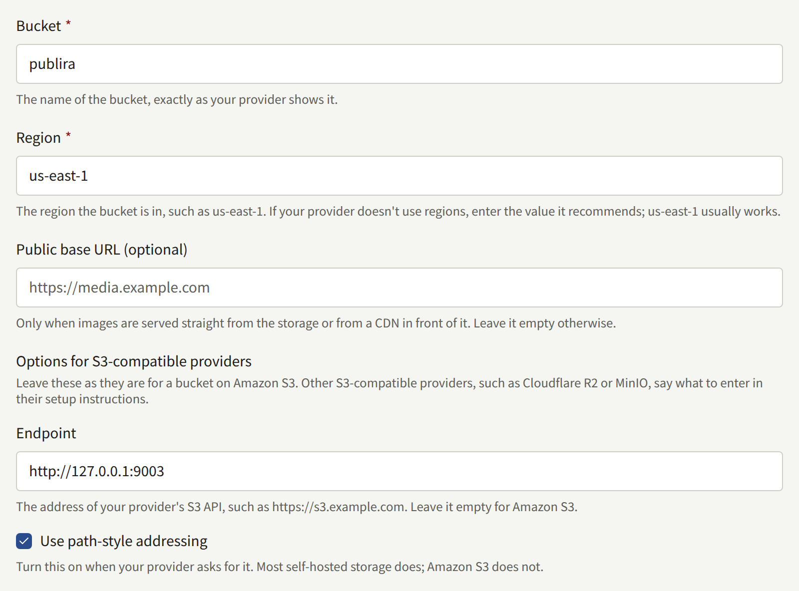
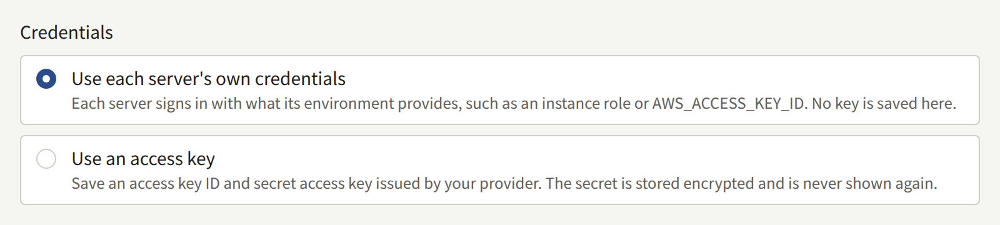
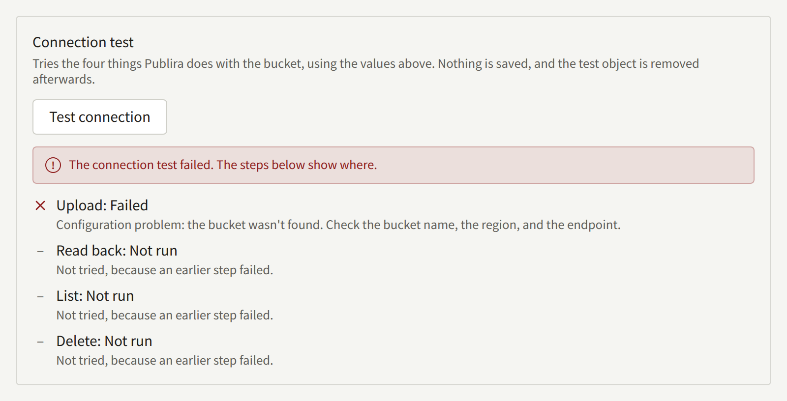
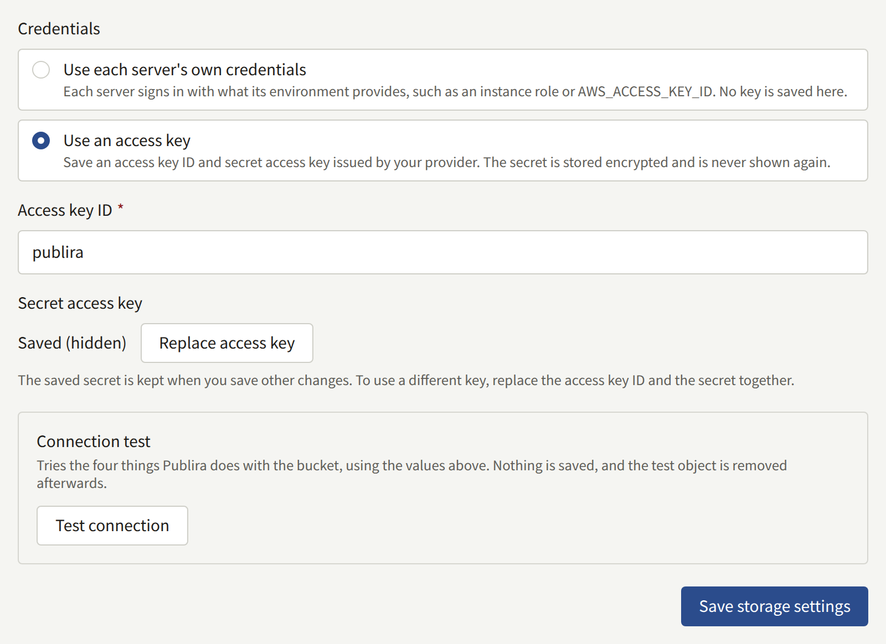

Every image the install keeps — covers, episode pages, author photos, each tenant's logo — is stored in one S3-compatible bucket shared by every tenant. `publiractl setup` saved that bucket. This page explains each of its settings, how to test them, and how to change them later, and how the stored images reach readers.

Every `publiractl` command here is shown bare; run it the way [The Platform Console and publiractl](./1-platform-console.md#choosing-between-them) describes, with `PUBLIRA_PLATFORM_DB_URL` set to the `publira_platform` connection and the same `PUBLIRA_SECRET_ENCRYPTION_KEYS` and `PUBLIRA_SECRET_ENCRYPTION_PRIMARY_KEY_ID` the processes run with. Every flag is in the [`publiractl` reference](https://github.com/publira/publira/blob/main/server/cmd/publiractl/README.md#storage).

## The bucket

Publira does not create the bucket. Create it with your provider first, empty, and give the credential Publira uses permission to upload, read, list, and delete objects in it. Nothing has to make the bucket public: readers never fetch from it directly.

The settings name the bucket and how to reach it:

| Setting | `publiractl storage set` | Platform Console |
| --- | --- | --- |
| The bucket's name | `--bucket` | **Bucket** |
| Its region | `--region` | **Region** |
| The address of a store other than Amazon S3 | `--endpoint` | **Endpoint** |
| Addressing the bucket in the URL path rather than in the host name | `--force-path-style` | **Use path-style addressing** |
| The URL stored objects are readable from | `--public-base-url` | **Public base URL (optional)** |



For a bucket on Amazon S3, give the bucket and its region and leave the rest out.

For another S3-compatible store — Cloudflare R2, MinIO, RustFS, or a provider's object storage — give its S3 API address as the endpoint, and turn on path-style addressing when the provider asks for it, as most self-hosted stores do. A store with no regions still needs a value for the region; enter the one its documentation recommends, and `us-east-1` when it recommends none.

Leave the public base URL empty. Images are always delivered through `publira server`, as [How images reach readers](#how-images-reach-readers) describes, whatever it holds.

## The credential

Publira signs every request to the bucket in one of two ways.

**An access key** saved with the settings: an access key ID and its secret access key, issued by your provider. The secret is stored encrypted with the install's encryption keys, so every process that reaches the bucket has to run with those keys, and it is never shown again once saved. This is the usual choice for a store other than Amazon S3, and the only one for an install whose processes have no credential of their own.

**The credential each process finds for itself**, with no key saved. Each process signs the way the AWS SDK does on its own: `AWS_ACCESS_KEY_ID` and `AWS_SECRET_ACCESS_KEY` in its environment, a web identity token, or the instance role of the machine it runs on. This keeps every long-lived secret out of the database on AWS, but then `publira server`, `publira worker`, and the `publiractl` you run all need that credential: the server uploads and reads images, the worker deletes the ones nothing uses any more, and `publiractl storage test` signs as well.

In the Platform Console, **Credentials** offers the two as **Use an access key** and **Use each server's own credentials**. With `publiractl storage set`, giving `--access-key-id` saves a key, with the secret read from a masked prompt, from `--secret-access-key-file`, or from stdin with `--secret-access-key-stdin`; leaving `--access-key-id` out signs with each process's own credential and removes a saved key.



## Testing the connection

The test uploads a small object, reads it back, lists it, and deletes it, which is everything Publira does with the bucket, and reports each of the four steps.

- In the Platform Console, **Test connection** under **Storage** tests the values in the form, before they are saved. It runs from `publira server`.
- `publiractl storage test` tests the settings already saved, from wherever `publiractl` runs, and exits `1` when a step fails.

A failure names the step and why: a credential the store refused, a permission the key lacks for one operation, a bucket that was not found under that name, region, and endpoint, or an endpoint that could not be reached. Since the console's test and the command run on different machines, a firewall that lets one reach the store and not the other shows up as a test that passes in one and fails in the other; it is `publira server` and `publira worker` that have to reach it.



## Changing the settings

### From the Platform Console

Choose **Storage** under **Services** in the sidebar. The screen shows the saved settings, with a saved secret as **Saved (hidden)**. Change the values, choose **Test connection**, and save with **Save storage settings**. To use a different access key, choose **Replace access key** and enter the access key ID and the secret together; the saved secret only goes with the ID it was saved with.



An Operator or a Super admin can save. An Auditor sees the screen and cannot.

### From publiractl

```bash
publiractl storage set \
  --bucket publira-images \
  --region ap-northeast-1 \
  --access-key-id AKIA... \
  --secret-access-key-file /run/secrets/aws-secret-access-key
publiractl storage test
publiractl storage show
```

`storage set` replaces every saved setting with the flags it is given, so name all of them each time: a flag left out clears its setting. Run with the same `--access-key-id` and no secret, it keeps the saved secret.

### When a change takes effect

Every process reads the settings again every 30 seconds, so a save reaches all of them within a minute, with no restart. Each save and each test is recorded in **Audit logs**.

### Moving to another bucket

Saving a new bucket does not copy anything into it. Images uploaded so far stay in the old bucket, and the install looks for them in the new one, where they are not. Copy the objects across before you save, keeping their keys, then save, then copy once more to pick up whatever was uploaded during the first copy. With the AWS CLI, or your provider's equivalent:

```bash
aws s3 sync s3://publira-images s3://publira-images-new
publiractl storage set --bucket publira-images-new --region ap-northeast-1 ...
aws s3 sync s3://publira-images s3://publira-images-new
```

Nothing in the install touches the old bucket after the save. Keep it until the install has been serving from the new one for a while, then delete it yourself.

### Rotating the access key

Issue a new key with your provider, save it with `storage set` or **Replace access key**, test it, and only then revoke the old key. The processes move onto the new one within a minute, so revoking the old key sooner leaves a window in which uploads and image reads fail.

## How images reach readers

Readers' browsers and the app fetch images from `/images` on the tenant's own host names, which the reverse proxy sends to `publira server`, as [Installing](../2-deployments/2-installing.md#5-put-the-reverse-proxy-in-front) routes it. For each request the server:

1. Checks that the reader may see the image. An episode page is shown only to a reader the episode is free for or who has unlocked it, and a page of an unpublished episode only to the tenant's staff in its console.
2. Reads the original from the bucket, converts it to WebP or AVIF, whichever the browser accepts, and resizes it to the size the page asked for.
3. Keeps the converted result in the conversion cache, so the next request for the same image at the same size does not read the bucket or convert again.
4. Encrypts an episode page before sending it to a reader, so what the browser receives is not an image file that can be saved and opened elsewhere. Covers, logos, and the other images are sent as they are.

This is why the bucket needs no public access, no CDN in front of it, and no resized copies made in advance: one original per image is all it holds.

### The conversion cache

The conversion cache is kept in the Valkey or Redis server `publira server` is given as `PUBLIRA_REDIS_URL`, shared by every instance of the server. Without one it is kept in each instance's memory, which works for a single instance and makes each additional instance convert every image again.

A converted image is kept for one hour unless `PUBLIRA_IMAGE_CACHE_TTL` on `publira server` says otherwise, as a duration such as `6h` or a number of seconds. A longer time reads the bucket and converts less often, at the cost of memory in Valkey; a shorter one does the opposite. Each image response carries `X-Publira-Image-Cache: hit` or `miss`, which shows whether the cache is doing its job.

The other image variables, and how the server is built with the libvips library the conversion needs, are in the [`publira server` reference](https://github.com/publira/publira/blob/main/server/cmd/publira/README.md#image-delivery).
