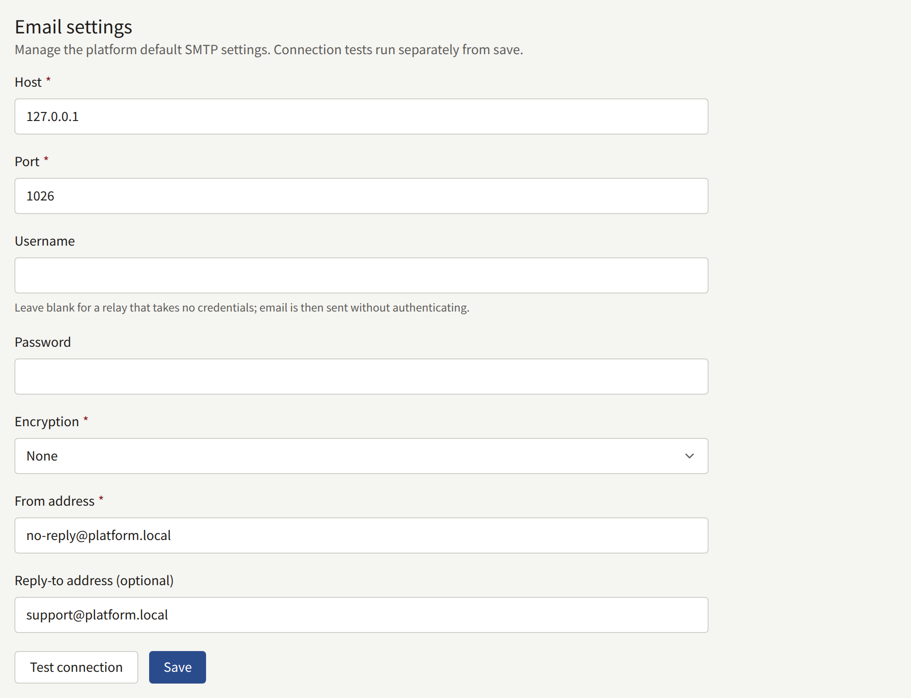
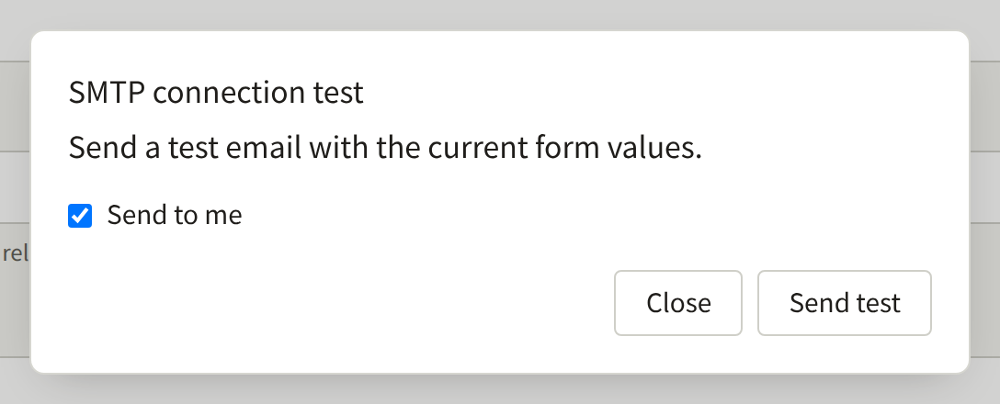
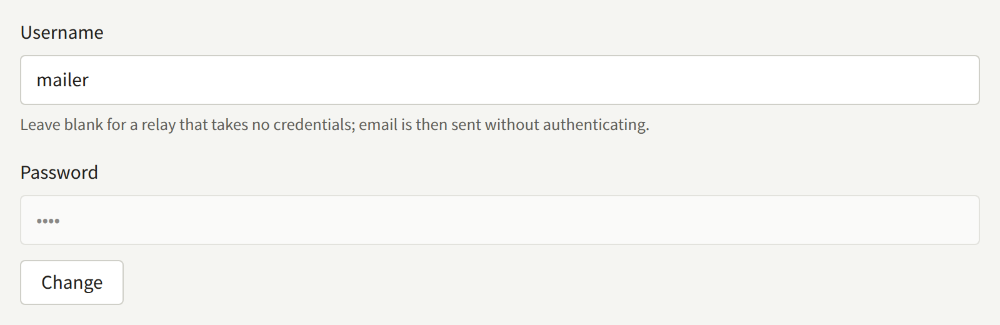

The install sends mail for its readers, for each tenant's staff, and for the Platform Console's operators. All of it is sent by `publira worker`, through an SMTP server you provide: `publiractl setup` saved the platform's SMTP account, and a tenant can save one of its own. This page covers both, how to test them, and the settings that decide how a mail looks and where its links go.

Every `publiractl` command here is shown bare; run it the way [The Platform Console and publiractl](./1-platform-console.md#choosing-between-them) describes, with `PUBLIRA_PLATFORM_DB_URL` set to the `publira_platform` connection and the same `PUBLIRA_SECRET_ENCRYPTION_KEYS` and `PUBLIRA_SECRET_ENCRYPTION_PRIMARY_KEY_ID` the processes run with. Every flag is in the [`publiractl` reference](https://github.com/publira/publira/blob/main/server/cmd/publiractl/README.md#smtp).

## The mail the install sends

| To | Mail |
| --- | --- |
| A tenant's readers | The link that confirms a new account's address; password reset, and the notice that the password changed; confirming a new email address, and the notice to the old one that it changed; the notice that someone tried to sign up with an address that already has an account; a staff member's answer to a contact message |
| A tenant's staff | The invitation to administer the tenant; password reset; confirming a new email address, and the notice to the old one; a new contact message from a reader |
| Platform operators | Password reset; confirming a new email address, and the notice to the old one |

Each mail is written in the tenant's default language, or for an operator in the platform's.

The worker queues every mail and retries one it could not send, waiting twice as long after each failure: one second, then two, then four. After the tenth failed attempt, about nine minutes after the first, it gives the mail up for good, and nothing sends it again. An outage of the SMTP server longer than that, or of `email-renderer` once it is on, therefore loses the mail queued during it rather than delaying it. `PUBLIRA_OUTBOX_MAX_ATTEMPTS` on `publira worker` sets the number of attempts; since the wait keeps doubling, up to an hour between attempts, a few more attempts cover a much longer outage.

Each mail given up on is logged by the worker as `outbox event dead`, and counted in the `publira.outbox.events.dead` metric when the worker exports OpenTelemetry metrics, so alert on either. The install cannot send such a mail again: a reader asks for a new password reset or confirmation mail, and an administrator invitation is resent, as [A tenant's staff](./3-tenant-staff.md) describes.

An install with no worker running sends no mail at all.

## Which SMTP account sends it

| Mail | Sent through |
| --- | --- |
| A tenant's mail, to its readers and its staff | The tenant's own SMTP account if it saved one and turned it on, and the platform's otherwise |
| The Platform Console's mail | The platform's SMTP account, always |

The platform's account is required: without it, no operator can reset a password, and every tenant without an account of its own sends nothing. A tenant's own account is optional, for a publisher who wants its mail to come from its own domain and its own provider.

## The platform's SMTP account

| Setting | `publiractl smtp set` | Platform Console |
| --- | --- | --- |
| The SMTP server | `--host`, `--port` | **Host**, **Port** |
| How the connection is encrypted | `--encryption`: `tls`, `starttls`, or `none` | **Encryption**: **TLS**, **STARTTLS**, or **None** |
| The user to sign in as | `--username` | **Username** |
| Its password | `--password-file`, `--password-stdin`, or a masked prompt | **Password** |
| The address mail is sent from | `--from-address` | **From address** |
| The address replies go to, when it is not the sender's | `--reply-to` | **Reply-to address (optional)** |



Use the values your mail provider gives for SMTP submission. Port 587 is almost always STARTTLS and port 465 TLS from the start. Choose **None** only for a relay on your own private network.

Leave the username empty for a relay that takes mail without signing in; the worker then sends without authenticating, and no password is kept. The password is stored encrypted with the install's encryption keys, so `publira worker` has to run with the same keys that saved it.

The from address has to be one your provider lets that account send as, and your domain should publish the SPF and DKIM records the provider asks for. Otherwise much of the mail ends up in spam, or is refused by the reader's mail server.

### Testing the account

A test sends one short message through the account and reports whether the server took it.

- In the Platform Console, **Test connection** under **Email** opens **SMTP connection test**, which sends with the values in the form, before they are saved, to you with **Send to me** or to another **Recipient email address**. It sends from `publira server`.
- `publiractl smtp test --to operator@example.com` sends with the settings already saved, from wherever `publiractl` runs, and exits `1` when the server refuses it.



A server that took the test message may still deliver it to spam; check the inbox it went to. And since the test is sent by `publira server` or `publiractl`, while real mail is sent by `publira worker`, make sure the worker can reach the SMTP server too.

### Changing it

In the Platform Console, choose **Email** under **Services** in the sidebar, change the values, and choose **Save**. A saved password is kept unless you choose **Change** beside it; saving the field empty after that removes it. An Operator or a Super admin can save, and an Auditor only sees the screen.



From `publiractl`:

```bash
publiractl smtp set \
  --host smtp.example.com --port 587 --encryption starttls \
  --username mailer --password-file /run/secrets/smtp-password \
  --from-address no-reply@example.com
publiractl smtp test --to operator@example.com
publiractl smtp show
```

`smtp set` replaces every saved setting with the flags it is given, so name all of them each time; a `--reply-to` left out clears the saved one. With the same `--username` and no password, it keeps the saved password.

The worker reads the settings for every mail it sends, so a save applies to the next mail, with no restart. Each save and each test is recorded in **Audit logs**.

## A tenant's own SMTP account

A tenant's administrators set its own account from the tenant console, under **Integrations** › **Email**. They turn on **Use this tenant's own SMTP server** with **Enable the override**, and enter the same values as the platform's, with a **Sender name (optional)** as well. **Test the connection** sends a test message through what the form holds, and **Save** saves it. Only a tenant administrator can change it, and [Email](../4-console/3-setup/6-email.md) walks them through it.

From the next mail on, every mail of that tenant goes through its account, invitations to new administrators included. Turning the override off sends them through the platform's account again.

There is nothing for an operator to set for this, and neither the Platform Console nor `publiractl` changes a tenant's account. If a tenant's mail stops arriving while the platform's test passes, its own account is the first thing to check.

## Plain text and HTML

Without `email-renderer`, every mail is plain text. With it, every mail carries an HTML version beside the same text, and the reader's mail app shows whichever it prefers. Turning it on is a matter of running it and pointing `publira worker` at it with `PUBLIRA_EMAIL_RENDERER_URL`, as [HTML mail with email-renderer](../2-deployments/2-installing.md#html-mail-with-email-renderer) describes.

Once it is on, the renderer is part of sending mail: while it is down, the worker retries each mail rather than sending it as text alone, within the same attempts as an SMTP outage, so a renderer down for longer than that loses mail too. To go back to plain text, remove the variable and restart the worker.

## Where the links in a mail lead

Most mail carries a link — to confirm an address, reset a password, or accept an invitation. The worker builds each one without knowing which host the request came in on, so the host and the scheme come from the install's settings, read by `publira worker`:

| Mail | Links lead to |
| --- | --- |
| To a reader | The tenant's domain, such as `https://comics.example.com` |
| To a tenant's staff | The tenant's console host, `admin.<domain>` unless the tenant was given another |
| To a platform operator | The address in `PUBLIRA_PLATFORM_APP_URL`, such as `https://platform.example.com` |

The scheme of a tenant's links is `PUBLIRA_TENANT_URL_SCHEME`, `https` unless set; set it to `http` only when browsers really open the tenant over HTTP. `PUBLIRA_PLATFORM_APP_URL` has to be set on `publira worker` on any install that runs the Platform Console: without it, an operator's link leads to the address of a local development machine.

A tenant's links follow its domain, so after a tenant moves to another host name the mail sent from then on leads to the new one, and the mail sent before still leads to the old one, as [Moving a tenant to another host name](./2-tenants.md#moving-a-tenant-to-another-host-name) describes.
