An episode is what a reader opens and pays for: a run of page images with a title, a price, and a time it is published at. Episodes live inside their series. On the **Series** list, choose **Episodes** on the series' row to open them.

The list shows each episode as its position and title, with its status, **Draft**, **Scheduled**, or **Published**, its price, and, for a scheduled one, the time it is due. An episode not shown on both the site and the app is marked **Web only**, **App only**, or **Not shown anywhere**. **Edit** opens the episode, or **View** for an Auditor.

An episode is made of page images, whether the work is a comic or not. Novels written as text are not supported yet ([#505](https://github.com/publira/publira/issues/505)).

## The order of episodes

Episodes are listed, and numbered on the site, in the series' order. A new episode goes to the end. To move one, drag it by its handle, or focus the handle and use the arrow keys. The list shows twenty episodes to a page, and an episode can be moved only within its page.

The site numbers each episode by its position, **Episode** followed by the number, counting the episodes readers cannot see yet. Keep drafts and scheduled episodes at the end of the order, so that the published ones are numbered without gaps.

A new order reaches the site as soon as it is saved.

## Creating an episode

Choose **Create** on the episode list and fill in:

- **Title**: the episode's title, such as `Episode 1 — A beginning morning`. It can be [changed later](#changing-the-title).
- **Price**: a whole number of yen. `0` makes the episode free.
- **Reading period**: how many hours a purchase keeps the episode open. `0` keeps it open with no end. It starts at the series' [Reading period](./1-series.md#reading-period).
- **Publication date and time**: when the episode is published, read in the tenant's time zone. Leave it empty to create a draft. A time that has already passed publishes the episode as soon as it is created.
- **Shown on** and **Sold on**: where the episode can be found and bought, as [Shown on and Sold on](#shown-on-and-sold-on) describes. Both start by following the series.

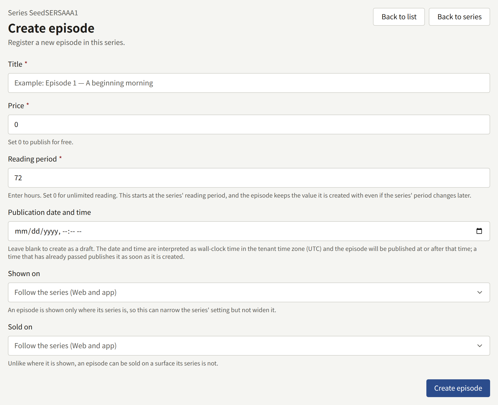

**Price** and **Reading period** can be [changed later](#changing-the-price-and-reading-period). [Selling episodes](../4-selling-episodes.md#how-a-reader-buys-an-episode) explains both.

Choose **Create episode**. The episode is created with the Authors credited on the series, and its edit screen opens to add its pages.

## Changing the title

**Title**, at the top of the episode's edit screen, holds the episode's title. Change it and choose **Update title**. The site and the app show the new title as soon as it is saved. A title cannot be left empty.

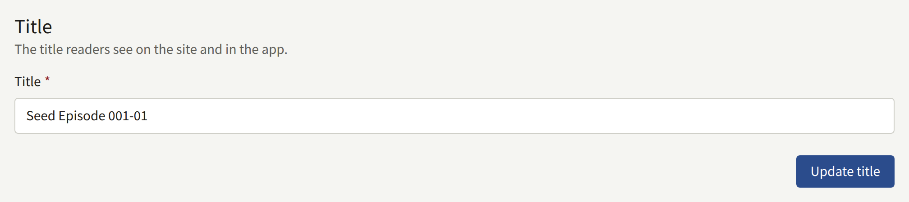

## Changing the price and reading period

**Price and reading period**, on the episode's edit screen, holds the two values the episode is sold on, with the same rules as when it was created: **Price** is a whole number of yen, `0` making the episode free, and **Reading period** is a number of hours, `0` keeping a purchase open with no end. Change either and choose **Update price and reading period**. The site and the app sell the episode on the new values as soon as they are saved.

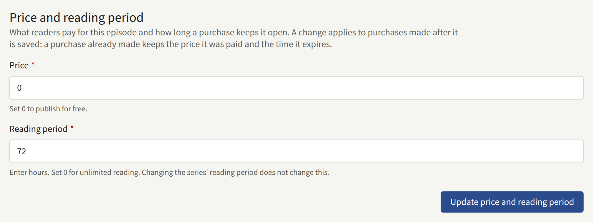

A change applies to purchases made after it is saved. A purchase already made keeps the price it was paid and the time it expires, and a reader who opened the payment provider's checkout page before the change pays what that page shows. Changing the series' **Reading period** does not change this one.

An app that sells through the stores buys an episode as the store product of its price, so a new price may need a new product: see [Store products](../4-selling-episodes.md#selling-in-the-app).

## Adding the pages

**Add comic pages**, on the episode's edit screen, adds pages in one of three ways under **Upload method**:

- **Select multiple page images** takes several JPEG, PNG, GIF, or WebP files at once, chosen or dropped onto **Page images**. They are added in the order the browser hands them over, usually by file name, so check the order afterwards.
- **Use a ZIP** takes a ZIP file and adds the `.png`, `.jpg`, `.jpeg`, and `.gif` images inside it, in the order of their paths, so `page2.png` comes before `page10.png`. Other files in it are ignored, WebP images among them, and it may hold up to 1000 images.
- **Use an ePub** takes an ePub file and adds the JPEG, PNG, GIF, or WebP images its pages show, in reading order, up to 1000 of them.

Choose **Add page images**, **Add a ZIP**, or **Add an ePub** to upload. Each image may be up to 20 MB, and one upload up to 256 MB, whichever of the three it is, so a whole episode can be added as one ZIP or ePub. One larger than that is added over several uploads; each adds its pages after the last one. The card states these formats and limits under the file picker.

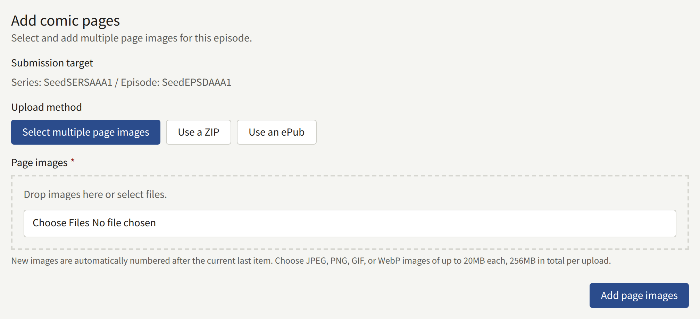

**Registered page images** shows the pages in order. Drag a page by its handle, or focus the handle and use the arrow keys, to move it. Under each page:

- **Replace** puts a new image in the page's place. Choose one JPEG, PNG, GIF, or WebP image of up to 20 MB under **New page image**, and choose **Replace page**. Every other page stays where it is.
- **Delete** takes the page out of the episode once **Delete page** confirms it. The pages after it move up one place. A deleted page cannot be brought back; add its image again to restore it.

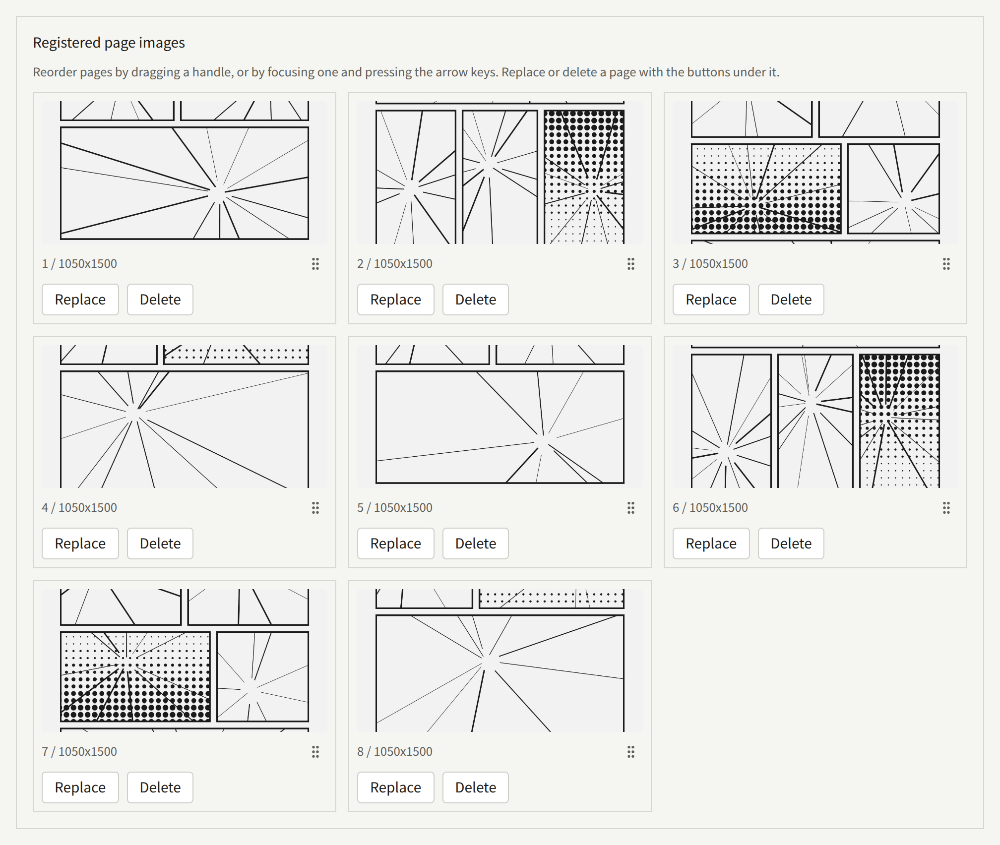

Pages added to an episode that is already published, a page replaced or deleted, and a new order of its pages reach readers as soon as they are saved. A published episode with no pages shows readers that its pages have not been published yet.

Deleting pages leaves the episode's own **Spreads start** under [Page layout](#page-layout) as it was. If that page is now past the last one, the episode is shown without spreads until it has that many pages again.

## Page layout

**Page layout** sets the two things a series decides for its episodes, for this episode alone:

- **Reading direction**: **Follow the series**, **Right to left**, or **Left to right**.
- **Spreads start**: **Follow the series**, or **Set for this episode**, which asks for the page spreads start at, from 1 to the episode's last page. Add the pages first: an episode without any can only follow the series.

Choose **Update page layout** to save. A value that follows the series changes whenever the series does. [Reading direction and spreads](./1-series.md#reading-direction-and-spreads) describes what each does in the viewer.

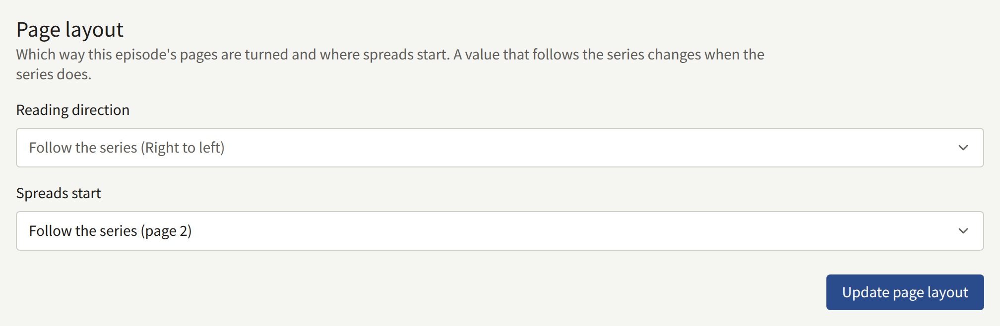

The site shows two pages side by side only in a viewer at least 768 pixels wide and no taller than it is wide, and the app only on a tablet or a phone held sideways. Elsewhere pages are shown one at a time.

## Credits

**Authors**, on the episode's edit screen, lists the Authors credited on this episode, each in a role, with their share of its sales. A new episode starts with the series' credits, and is changed here on its own: a later change to the series' credits does not reach it. A credit added here is marked **Episode only**, for a guest who worked on this episode alone. Choose **Save authors** to save.

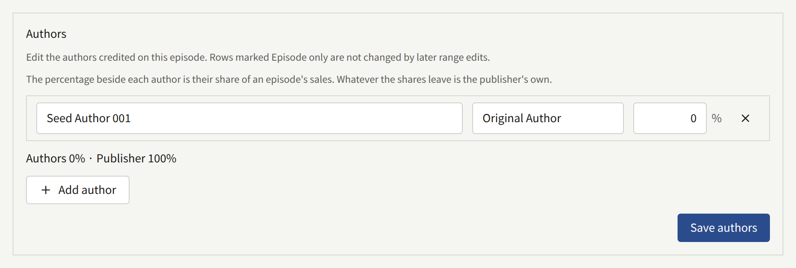

The episode page on the site shows these credits, and the series page shows the series' own. The episode's credits are also the ones royalties are paid on, as [Reports and royalties](../5-reports-and-royalties.md#what-an-author-is-owed) describes, and an Author linked to a reader account can read the episodes credited to them, as [Authors and Author roles](./4-authors.md#linking-an-author-to-a-reader-account) describes.

To change the credits of many episodes at once, such as when an artist joins from episode 12, select the episodes on the list and choose **Credits**. Under **Operation**:

- **Add** credits an Author in a role on every selected episode that does not already have them in that role, with no share.
- **Replace** turns one credit into another.
- **Remove** takes a credit off.
- **Set share** changes a credit's share.

Choose the **Author** and **Role** the operation applies to, check the episodes under **Episodes**, which lists every episode of the series, up to 1000 at a time, and choose **Apply**. **Replace**, **Remove**, and **Set share** leave **Episode only** credits alone. The result says how many episodes changed, and why each of the others did not.

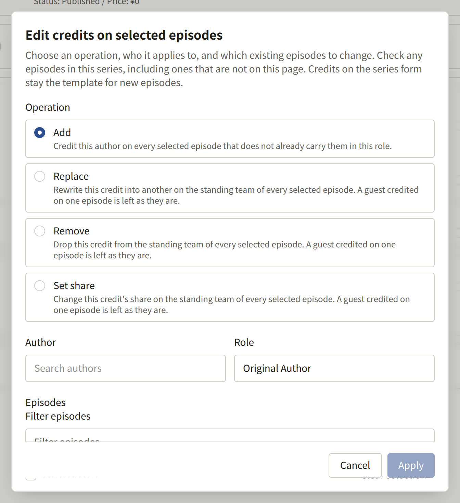

## Shown on and Sold on

Each episode has its own **Shown on** and **Sold on**, which start by following the series:

- **Shown on** can narrow where the series is shown, but not widen it. An episode set to **Web only** in a series shown on **App only** is shown nowhere, and the screen warns about it. Choose **Update where it is shown** to save.
- **Sold on** can name a surface the series' own **Sold on** does not, but an episode is only ever sold where it is also shown. Choose **Update where it is sold** to save.

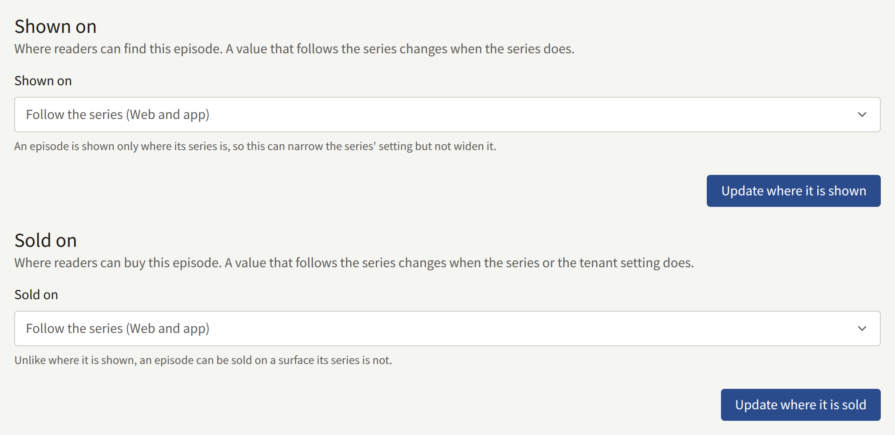

Setting **Shown on** so that the episode is shown nowhere takes a published episode off the site without unpublishing it. [Selling episodes](../4-selling-episodes.md#where-episodes-are-sold) covers what readers see where an episode is not sold.

## Free reading periods

A free reading period opens a paid episode to everyone, signed in or not, between two times. The episode keeps its price, which applies again when the period ends. A period on a free episode does nothing.

**Free reading periods**, on the episode's edit screen, lists its periods as **Free now**, **Scheduled**, or **Ended**. To add one, enter **Starts** and **Ends**, both in the tenant's time zone, and choose **Add free reading period**. **Ends** must be after **Starts** and still in the future; **Starts** may be in the past, which makes the episode free from now. Two periods of one episode cannot overlap, though one may start exactly when another ends.

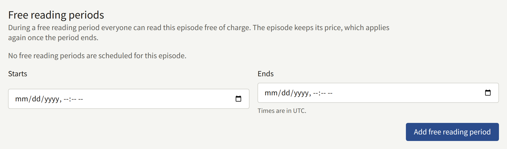

A period cannot be edited. **Delete** it and add another; deleting a period that has started prices the episode again at once.

To give many episodes the same period, choose **Free reading period** on the episode list. Under **Episodes**, choose **Selected episodes**, the episodes checked on the list, **First episodes**, the first so many in the series' order, or **All episodes**. Then enter **Starts** and **Ends** and choose **Add**. Nothing is added if the period overlaps one already on any of the episodes.

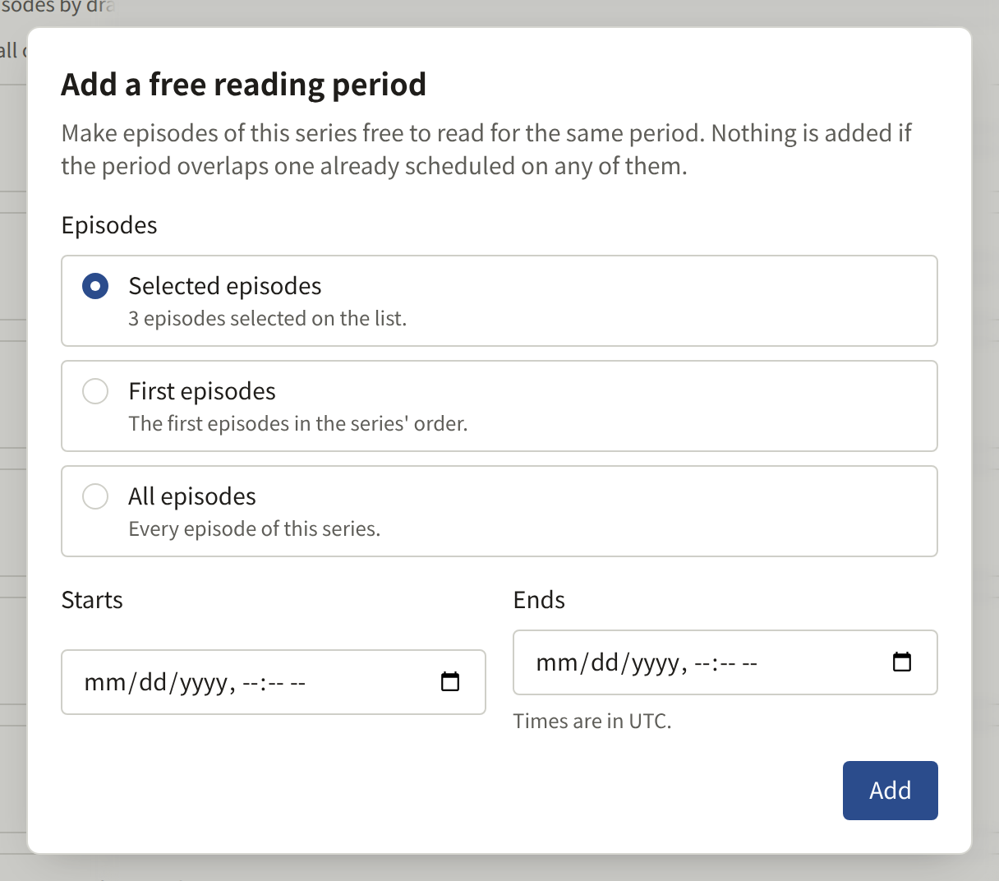

The site shows a period from the moment it starts, and drops it the moment it ends: `publira worker` refreshes the cached pages at both ends, as [Scheduled and maintenance jobs](../../3-operations/10-scheduled-jobs.md#free-reading-periods-and-other-cached-pages) describes.

## Publishing an episode

An episode is in one of three states:

| Status | What it means |
| --- | --- |
| **Draft** | It has no publication time. Readers cannot see it |
| **Scheduled** | It has a publication time still ahead. Readers cannot see it until then |
| **Published** | Its time has passed. Readers can open it, as long as its series is public and it is shown on their surface |

Until an episode is published, its page answers as if it did not exist, it is in no list, and the previous and next links of its neighbours skip it.

### Setting the time

**Publishing settings**, on the episode's edit screen, sets or changes the time of an episode that already exists. Enter a time in the tenant's time zone, or empty the field, and choose **Update publication date and time**:

- **A time that has passed**, such as the current time, publishes a draft or a scheduled episode at once. It is announced to its followers and sent to the search index, just as a scheduled episode is when its time comes. A published episode stays as it is, so saving the section with the time it already shows changes nothing.
- **A time in the future** schedules the episode for that time.
- **An empty field** makes the episode a draft.

A published episode is taken off the site by the last two, as [Taking an episode off the site](#taking-an-episode-off-the-site) describes.

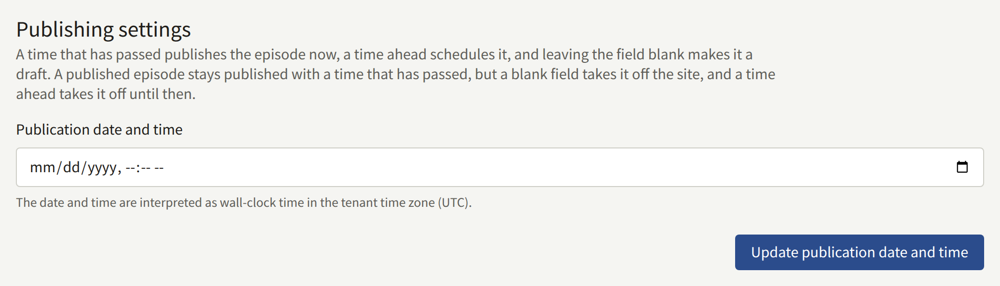

The usual way to publish a new episode of a public series is therefore:

1. Create the episode with **Publication date and time** empty, as a draft.
2. Add its pages, and check them and its layout.
3. Under **Publishing settings**, enter the current time to publish it now, or the time it should go out, and save.

### When a scheduled episode appears

The episode is published by `publira worker`, which looks for episodes whose time has passed once a minute. At that pass, the episode:

- Opens on its own page and in its series' episode list on the site, and in the app.
- Is announced to every reader following the episode, its series, or an Author credited on it, with a notification and a push notification on each of the site and the app it is shown on.
- Is sent to the search index.

So an episode scheduled for 12:00 is readable by about 12:01, and the site's lists, such as the series list ordered by **Recently updated**, show it from the same moment.

An episode that is still **Scheduled** well after its time means the worker is not running, or is failing to publish it. A Tenant admin then gets a notification titled "An episode could not be published". This is for the operator to fix, as [Scheduled and maintenance jobs](../../3-operations/10-scheduled-jobs.md#scheduled-publication) describes, and the episode goes out on its own once it is. To publish it without waiting, enter the current time under **Publishing settings** and save.

An episode published while its series is not public, or while it is **Not shown anywhere**, is announced to nobody, so that no notification leads to a page that is not found. It is not announced later when the series is published either ([#4044](https://github.com/publira/publira/issues/4044)). An episode shown on only one of the site and the app is announced there alone: readers see its notification in that one's notifications, and its push notification reaches only their browsers or only their phones. Where an episode is announced is decided when it is published, and changing its **Shown on** later does not move a notification already sent. Publish the series first, and set where an episode is shown before its time.

### Taking an episode off the site

A published episode cannot be deleted. To take it off the site:

- **Empty the field** under **Publishing settings** and save. The episode goes back to **Draft**.
- **Enter a time in the future** and save. The episode is off the site until then, and is published again at that time without announcing it to followers a second time.
- **Set Shown on** so it is shown nowhere. The episode stays published, and comes back as soon as the setting is changed.

Readers who bought the episode lose access to it with any of these, until it is back.
