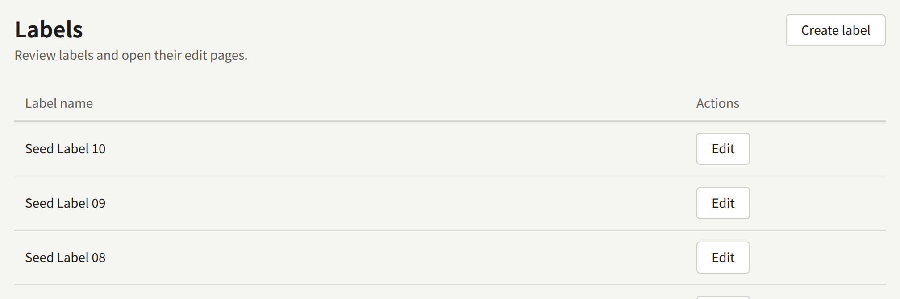
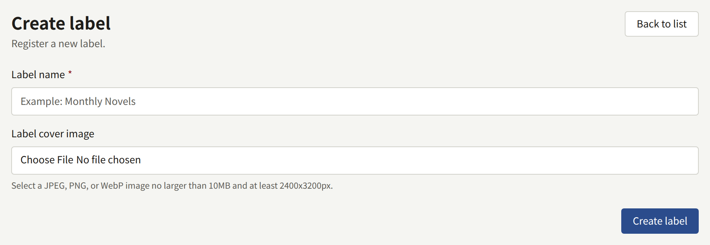
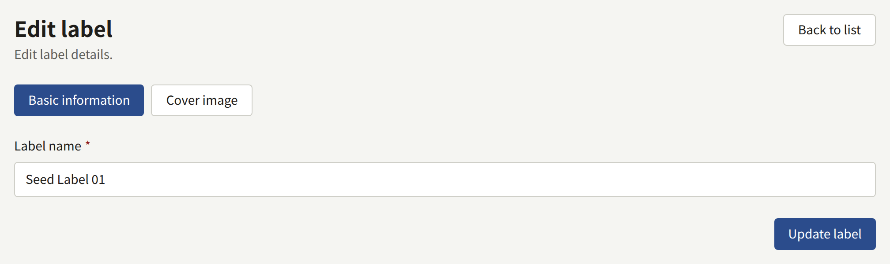

A label is an imprint: the name a publisher gives a line of its works, such as a magazine or a collection. Every series belongs to exactly one, which is why a series cannot be saved until a label exists. A publisher with a single imprint creates one label and files every series under it.

**Labels**, in the sidebar's **Catalog** group, lists them, newest first, twenty to a page.

## Creating a label

Choose **Create label**, enter a **Label name**, and choose **Create label**. A **Label cover image**, a JPEG, PNG, or WebP image of at most 10 MB and at least 2400 × 3200 pixels, is optional and can be added later.

The label's page has two tabs. **Basic information** changes its name, with **Update label**. **Cover image** replaces or removes its image, and adjusts the four shapes cut from it, as [The cover image](./1-series.md#the-cover-image) describes for a series.

Two labels can have the same name, and a label cannot be deleted, so check the list before creating one.

## On the site

- **Labels**, in the site's header, lists every label with the number of its published series.
- Each label has a page with its name, its cover image as a wide banner, and its published series in title order.
- A series page names its label and links to it.
- **Featured labels** on the top page shows the six labels created most recently that have a published series, with a link to all of them.

A label is listed under **Labels**, and its page answers, from the moment it is created, before any series in it is public, showing "0 published series". It appears under **Featured labels** only once one of its series is published, so give it its name and cover image before then.

A label whose published series are all kept off one surface, by their **Shown on**, is not listed on that surface.
