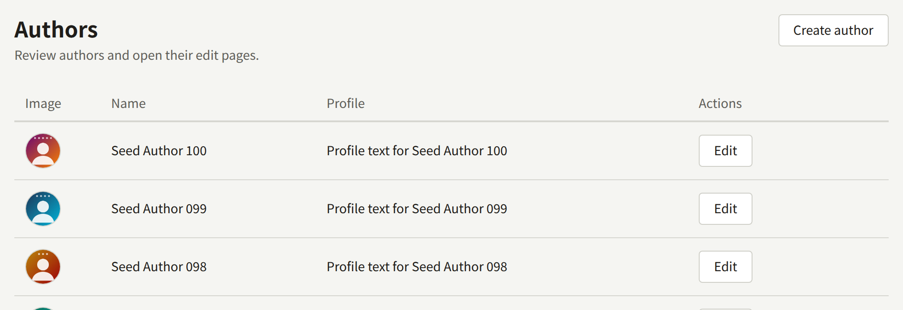
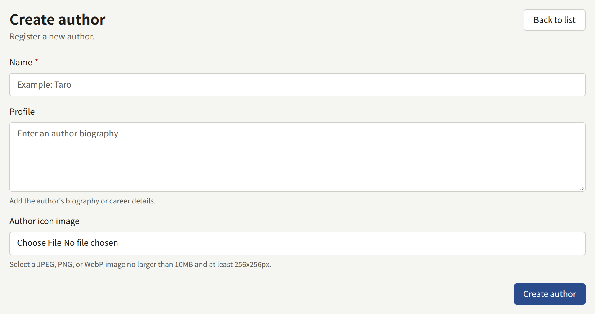
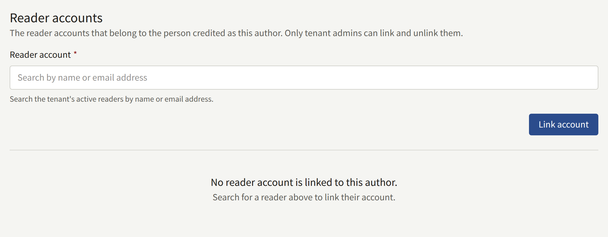
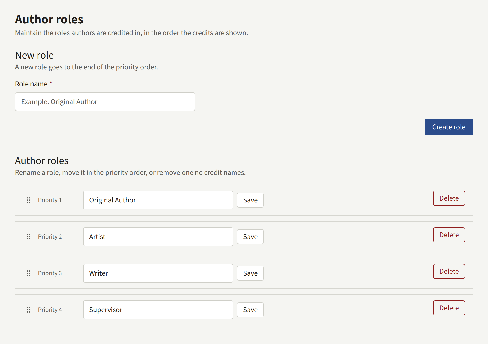
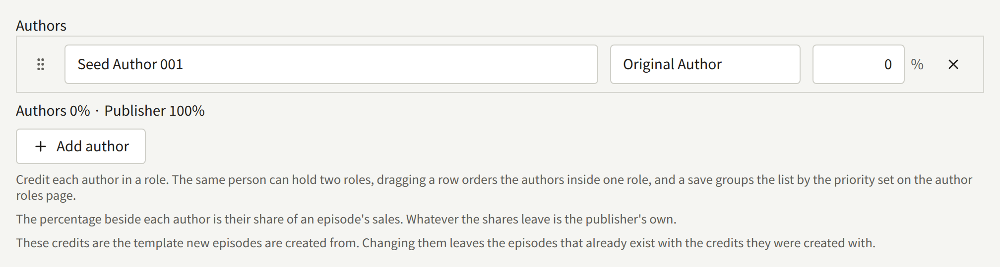

An Author is a person credited on a work: the writer, the artist, the original author of an adaptation. A series and each of its episodes credit their Authors, each in an Author role, and those credits are what readers see beside a title and what royalties are paid on.

## Authors

**Authors**, in the sidebar's **Catalog** group, lists the tenant's Authors, newest first, twenty to a page. Choose **Create author** and fill in:

- **Name**: the name readers see, a pen name if the person publishes under one.
- **Profile**: an optional biography, shown on the Author's page as written, line breaks included.
- **Author icon image**: an optional JPEG, PNG, or WebP image of at most 10 MB and at least 256 × 256 pixels. **Adjust the frame** chooses the square cut from it.

Choose **Create author** to save. The same form, with **Update author**, changes the Author later. An Author cannot be deleted, and two Authors can share a name, so check the list first.

A person who publishes under two pen names is two Authors.

### On the site

- Each Author with at least one published series has a page with their icon, name, profile, and the series credited to them, in title order. Readers can follow an Author there, and are told about each new episode credited to them.
- The site's Authors list, and **Featured authors** on the top page, show those Authors in name order.
- An Author without a published series has no page.

The credits on a series or episode page are plain text and do not link to the Author's page.

### Linking an Author to a reader account

A Tenant admin can record that an Author is a particular reader of the site, under **Reader accounts** on the Author's page. Editors and Auditors do not see this section.

Search **Reader account** for the reader by name or email address, and choose **Link account**. The reader must already have an account on the site, with a confirmed email address, and a staff account cannot be linked. An account can be linked to several Authors, and an Author to several accounts.

Once linked, the reader:

- Can read every episode credited to the Author, on the episode's own credits, without buying it. The episode tells them it is open to them as its author. A credit on the series alone does not open its episodes, and the series' age rating still applies.
- Is not offered a purchase of those episodes, and cannot rate them.
- Is shown with an **Author** badge on their comments on those episodes, with their name linked to the Author's page.

A linked reader sees no sales figures or royalty statements; those stay in the console, as [Reports and royalties](../5-reports-and-royalties.md) describes. **Unlink** removes the link, and leaves the reader's account as it was. Both are recorded in the audit log.

## Author roles

An Author role is what an Author is credited as. Every credit names one, and the same Author can be credited twice on a series in two roles.

A new tenant has four roles: **Original Author**, **Artist**, **Writer**, and **Supervisor**. Their names are stored as they are, in English, and readers see them as written, so a site in another language renames them.

**Author roles** lists them in their priority order. On it:

- **New role** adds a role, with **Role name** and **Create role**. Names are up to 50 characters and must be unique, ignoring case. A new role goes to the end of the order.
- Each role's name can be changed in place, with **Save**. Every credit in the role shows the new name.
- Drag a role by its handle to change the order.
- **Delete** removes a role that no credit names. A role still in use cannot be deleted: the console says how many credits use it, and those credits must first be moved to another role.

Without any role, nobody can be credited.

## Crediting Authors

Credits are entered under **Authors** on the series form and on each episode's edit screen. Each row names an **Author**, a **Role**, and a share, the percentage of the sales the Author is paid royalties on. Whatever the shares leave is the publisher's. The shares together cannot go over 100%.

On saving, the rows are grouped by role in the roles' priority order; drag a row to order the Authors inside one role.

The site shows the credits the same way: each role followed by its Authors, such as "Original Author Name1, Name2 / Artist Name3". A series page shows the series' credits, and an episode page the episode's own.

The series' credits are the template for its new episodes: an episode is created with a copy of them, and keeps that copy when the series' credits change. [Credits](./2-episodes.md#credits) describes changing them on an episode, or on many episodes at once, and [Reports and royalties](../5-reports-and-royalties.md#what-an-author-is-owed) how the shares become royalties.
