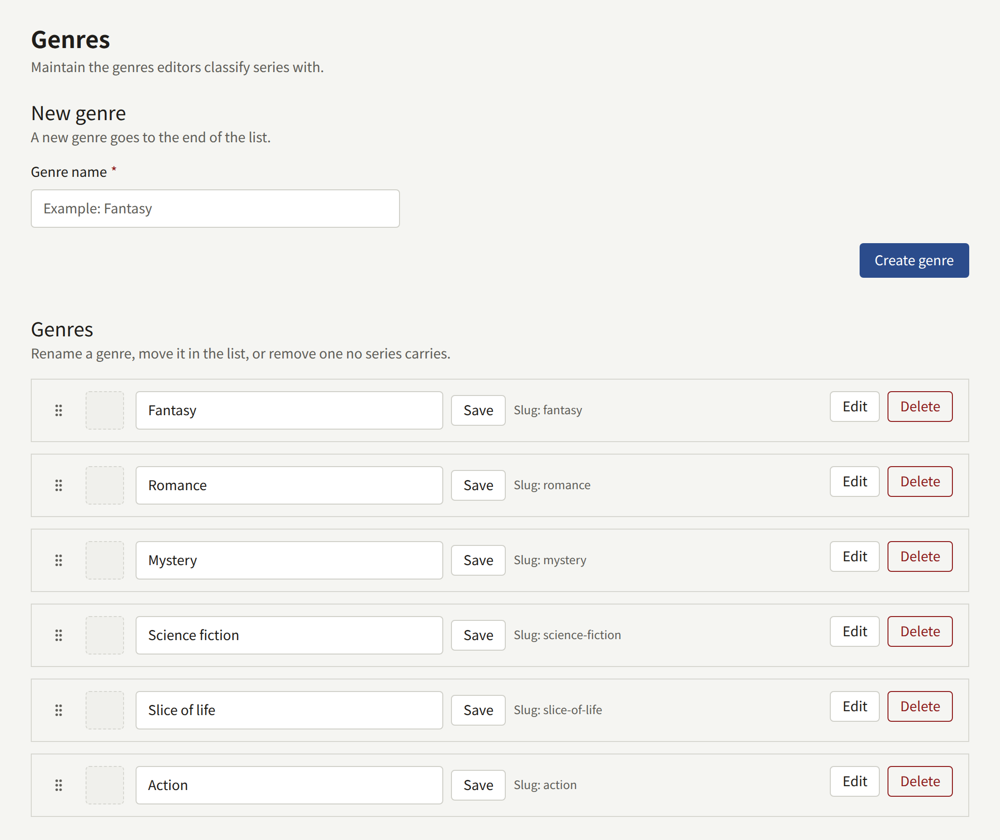

A genre is a category the tenant files its series under, such as fantasy or romance. A series can be in any number of genres, chosen on its form, and readers browse the catalog by them. The genres are the tenant's own: nothing is predefined, and there is one flat list of them.

**Genres**, in the sidebar's **Catalog** group, holds the whole list on one page.

## Managing genres

- **New genre** adds one, with **Genre name** and **Create genre**. Names are up to 50 characters and must be unique. A new genre goes to the end of the list.
- Each genre's name can be changed in place, with **Save**.
- Drag a genre by its handle to change its place. The order is the one the site lists genres in, and the one a series' genres are shown in.
- **Edit** opens a genre's page, whose **Cover image** tab gives it an image, as [The cover image](./1-series.md#the-cover-image) describes for a series.
- **Delete** removes a genre no series is in. A genre still in use cannot be deleted: take it off every series first.

A genre's name is shown as written in every language the site offers, so choose names that read in all of them.

## On the site

- **Browse by genre** on the top page shows every genre, in the list's order, with the number of its published series. The section is hidden while the tenant has none.
- **Genres**, in the site's header, shows every genre as a tile, with its cover image or, without one, the covers of a few of its series.
- Each genre has a page with what is popular in it this week, and its series, which readers can narrow by status and other filters.
- A series page links to each of its genres.
