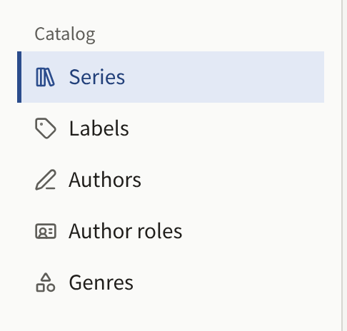

Everything a reader can open on the site is an episode of a series, and a series is filed under a label and credits its Authors. The sidebar's **Catalog** group holds the five screens these are made on:

| Screen | What it holds |
| --- | --- |
| **Series** | The works, with their episodes |
| **Labels** | The imprints a series is published under |
| **Authors** | The people credited on series and episodes |
| **Author roles** | What an Author is credited as, such as **Original Author** or **Artist** |
| **Genres** | The categories readers browse the catalog by |

A Tenant admin and an Editor can create and change everything on these screens, except that only a Tenant admin sees and changes the **Reader accounts** linked to an Author. An Auditor can open every one of them, with their forms read-only, and does not see the buttons that create anything. Nothing in the catalog can be deleted except an episode's pages, and Author roles and genres that nothing uses, so a series or an episode that should no longer be read is taken off the site rather than removed.

## From an empty catalog to a first episode

The order below is the one the console needs: a series cannot be saved without a label, an Author is credited from a list of Authors that already exist, and an episode belongs to a series. The series stays hidden while its first episode is prepared, and both reach readers in the last step.

1. **Create a label.** Under **Labels**, choose **Create label**, enter a **Label name**, and choose **Create label**. A publisher with a single imprint creates this one label and files every later series under it too, rather than a label per series. See [Labels](./3-labels.md).
2. **Create the Authors.** Under **Authors**, choose **Create author** for each person to be credited, with their **Name** and, if you have them, a **Profile** and an **Author icon image**. See [Authors and Author roles](./4-authors.md).
3. **Check the Author roles.** A new tenant has four, **Original Author**, **Artist**, **Writer**, and **Supervisor**, in English. Rename them under **Author roles** if the site is in another language, since readers see them beside each name.
4. **Create the genres** the site will be browsed by under **Genres**, if it has any. A series can be saved without one and given its genres later. See [Genres](./5-genres.md).
5. **Create the series.** Under **Series**, choose **Create series**. Fill in its **Title**, **Synopsis**, and **Label**, credit its Authors under **Authors**, choose a **Cover image**, and leave **Publication date and time** empty, so the series stays hidden while you work. Choose **Create series**. See [Series](./1-series.md).
6. **Create the first episode.** On the **Series** list, choose **Episodes** on the series' row, then **Create**. Enter its **Title** and **Price**, and set **Publication date and time** to the current time, which publishes it as soon as it is created. It is not readable yet, since its series is still hidden. Choose **Create episode**. See [Episodes](./2-episodes.md).
7. **Add its pages.** On the episode's edit screen, under **Add comic pages**, add the page images, then check their order under **Registered page images**.
8. **Publish the series.** Back on the series, set **Publication date and time** to the current time and choose **Update series**. The series and its first episode are now on the site.
9. **Open it as a reader.** Sign out, or use a private window, and find the series on the site's top page, under **Labels**, or by searching for its title. Open the episode and turn its pages. A paid episode shows its price instead, and is opened as [Selling episodes](../4-selling-episodes.md) describes.

The episodes that follow are added to a series that is already public, so they are prepared as drafts and given their time once their pages are in place, as [Publishing an episode](./2-episodes.md#publishing-an-episode) describes.

## In this section

- [Series](./1-series.md): creating a series, where and when it is shown, its age rating, reading direction, comments, cover image, and **Free if you wait**.
- [Episodes](./2-episodes.md): creating an episode, adding its pages, its page layout, credits, where it is shown and sold, free reading periods, and scheduled publication.
- [Labels](./3-labels.md): the imprints series are published under, and the label pages readers see.
- [Authors and Author roles](./4-authors.md): the people credited on a work, what they are credited as, how the credits read on the site, and linking an Author to their reader account.
- [Genres](./5-genres.md): the categories readers browse by, and their order.
