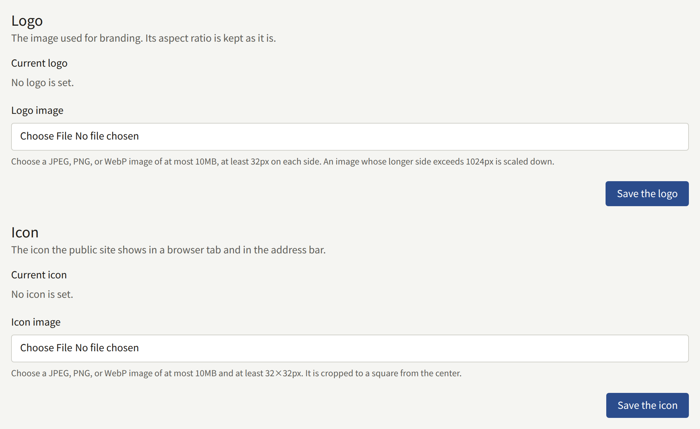
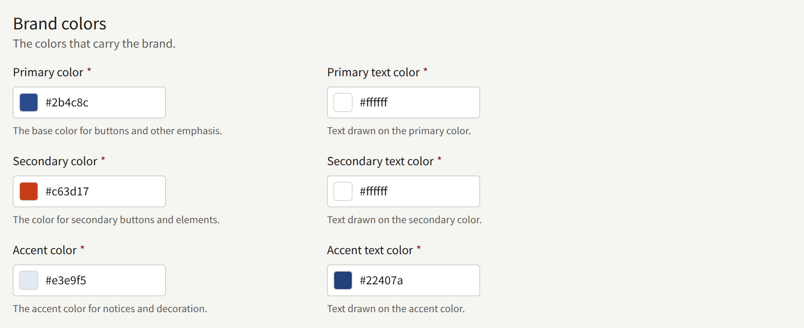
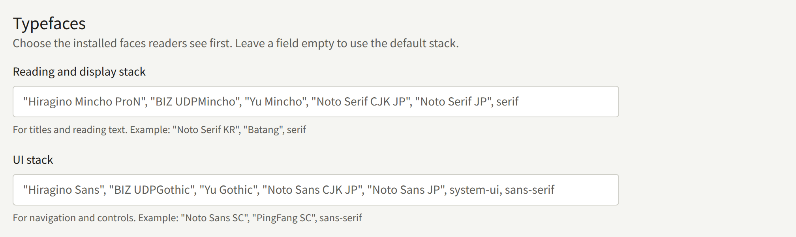
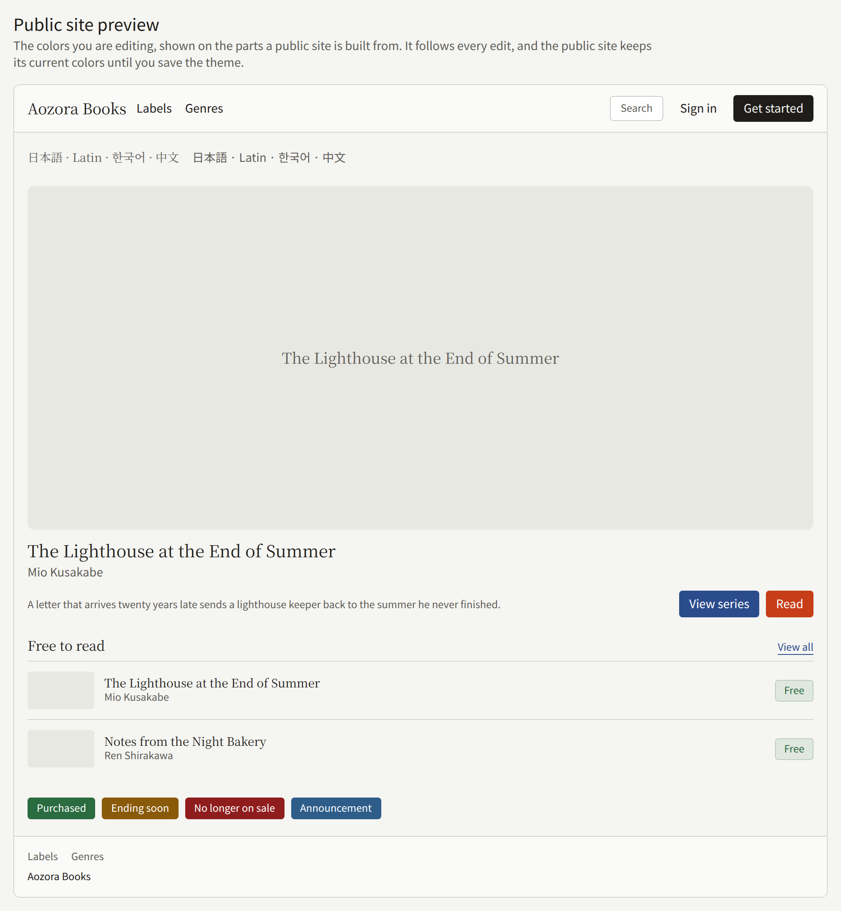

**Branding**, under **Administration**, decides how the site looks: the logo in its header, the icon in the browser's tab, its colors, and the faces its text is set in. The screen has three cards: **Logo**, **Icon**, and the theme's colors and typefaces. Each card is saved on its own, and saving one leaves the others as they are.

Only a Tenant admin can change branding. Editors and Auditors see the same screen with its controls turned off.

## Logo and icon

Both take a JPEG, PNG, or WebP image of at most 10MB. Each is stored as a PNG, so a transparent background stays transparent.

|  | **Logo** | **Icon** |
| --- | --- | --- |
| Where it appears | In place of the site's name at the top of every page of the site and of this console. The tenant's app shows it in place of the name on its catalog screen | In the browser's tab and address bar, and as the icon a phone uses when a reader adds the site to their home screen |
| Shape | Kept as it is | Cropped to a square from the center |
| Size | An image wider or taller than 1024px is scaled down, and must still be at least 32px on each side afterwards | At least 32×32px. An image larger than 512×512px is scaled down |
| Without one | The site shows the tenant's name | The browser shows its default icon |

Choose the file under **Logo image** or **Icon image**, then **Save the logo** or **Save the icon**. Saving again replaces the image. **Delete** removes it after you confirm.

Give the icon a square image with the mark in its middle, since anything outside the central square is cut off. Give the logo an image with little empty space around the mark. The site's header shows it 32px tall and at most 144px wide, so a logo more than four and a half times as wide as it is tall is shown shorter than that.

An upload is refused with "Images cannot be uploaded because image storage has not been set up on the platform yet. Ask a platform operator to set it up." when the operator has not set up object storage for the install, as [Object storage](../../3-operations/5-object-storage.md) describes.

Neither image is used in the tenant's mail, which is sent in Publira's own colors, or as the picture shown when a link to the site is shared, which comes from the series being linked.

## Theme colors and typefaces

### Colors

The theme has 27 colors, each entered as `#RRGGBB` or chosen with the swatch beside it. They come in four groups:

- **Brand colors**: the **Primary color**, **Secondary color**, and **Accent color**, each with a text color drawn on it. The primary color carries buttons and other emphasis.
- **Background and text colors**: the page's background and text, and the surfaces, cards, popovers, and muted areas drawn on it, each with its text color.
- **UI element colors**: borders, input fields, and the ring that shows which control has keyboard focus.
- **Status colors**: the colors of success, warning, error, and informational notices, each with its text color.

Each color and the text color drawn on it must contrast by at least 4.5:1, the WCAG AA level for normal text. A pair below that is refused, with the ratio it reached, under "Check these color pairs so the text stays readable." Border, input field, and focus ring colors are not checked, since no text is drawn on them.

The site has one set of colors. It does not switch to a dark version when a reader's device is in dark mode.

### Typefaces

**Typefaces** has two fields:

- **Reading and display stack**: the faces for titles and reading text.
- **UI stack**: the faces for navigation and controls.

Each is a comma-separated list of font family names, written as in CSS, such as `"Noto Serif KR", "Batang", serif`. The reader's device uses the first face on the list it has installed. No font is downloaded, so name faces your readers' devices have, and end the list with `serif` or `sans-serif`. Left empty, a field uses Publira's default list, shown as its placeholder, which favors Japanese faces. A site for readers of another script should name faces for that script first.

The tenant's app uses the theme's colors but not its typefaces.

### Previewing and saving

While you edit, the console itself takes on the new colors, so you can see them before saving. The **Preview** tab shows them on the parts a site is built from: a header, a featured series, a list of episodes, badges, and a footer, with a line of Japanese, Latin, Korean, and Chinese text in both stacks. The preview does not show the logo or the icon.

Nothing reaches the site until you choose **Save the theme**. Readers then see the new theme within about a minute and a half, as their browsers and the site's cache pick it up.

The console has no button that returns the theme to Publira's defaults. Each color's default is the value the field shows on a new tenant, so note them before you change them.
