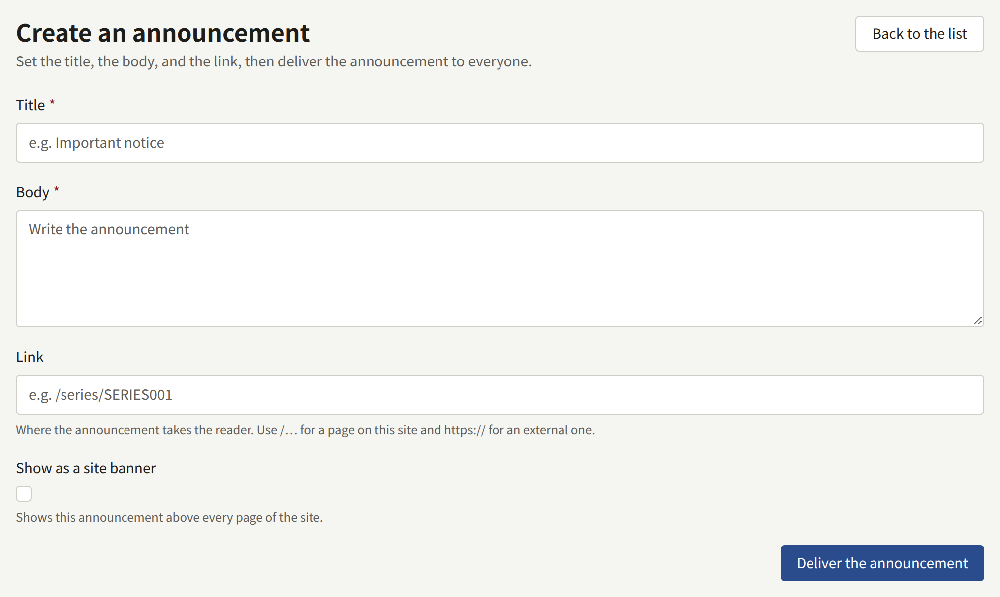
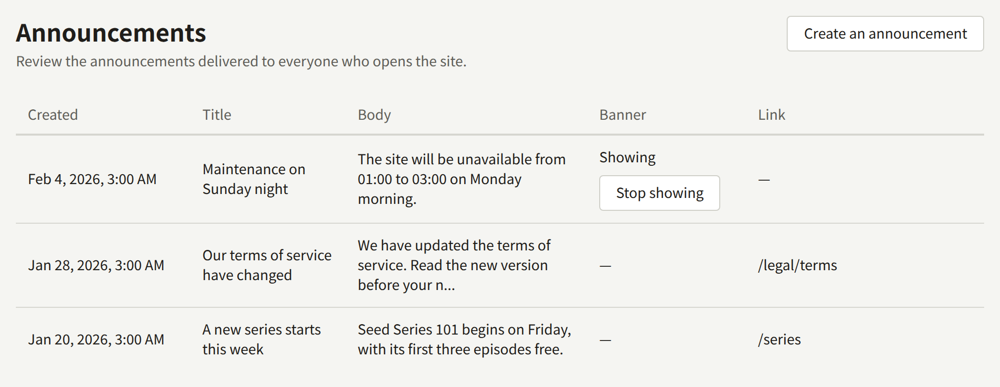

**Announcements**, under **Site**, is how the publisher tells every reader something at once: a new series, a change to the terms, a maintenance window. Each announcement is listed on the site's **Announcements** page and delivered to every reader's notifications. One of them at a time can also be shown as a banner above every page of the site and the app.

A Tenant admin and an Editor can create announcements and take banners down. An Auditor sees the list only.

## Creating an announcement

Choose **Create an announcement** and fill in:

- **Title**: up to 120 characters.
- **Body**: up to 2000 characters of plain text.
- **Link** (optional): where the announcement takes a reader who opens it. Start it with `/` for a page of this site, such as `/series/SERIES001` or `/legal/terms`, or with `https://` or `http://` for another site.
- **Show as a site banner**: also shows the announcement above every page. See [The site banner](#the-site-banner).

**Deliver the announcement** delivers it at once. An announcement has no draft and cannot be scheduled, edited, or deleted afterwards, so read it over before you deliver it.

## What readers see

- **On the site**, the **Announcements** page in the header lists every announcement, newest first, and anyone can read it. A signed-in reader sees which ones they have not read yet.
- **In their notifications**, every reader with an account gets "A new announcement", which leads to it. Announcements are not sent by email or as push notifications.
- **In the app**, the **Announcements** screen lists the same announcements, with the same read marks.

## The site banner

An announcement created with **Show as a site banner** is shown above the header of every page of the site, to every visitor, signed in or not, and at the top of the app's catalog screen. A visitor can close it, and it then stays closed in that browser.

Only one banner is shown at a time: the newest announcement whose banner is still up. Creating a new banner therefore hides the previous one until the new one comes down.

A banner stays up until you take it down, unless you give it an end:

- **Stop showing at**, under the banner checkbox, takes it down at that time, in the tenant's time zone. It must be in the future.
- **Stop showing**, in the **Banner** column of the list, takes it down at once.

Either way the announcement stays on the **Announcements** page and in readers' notifications. Only the banner goes.
