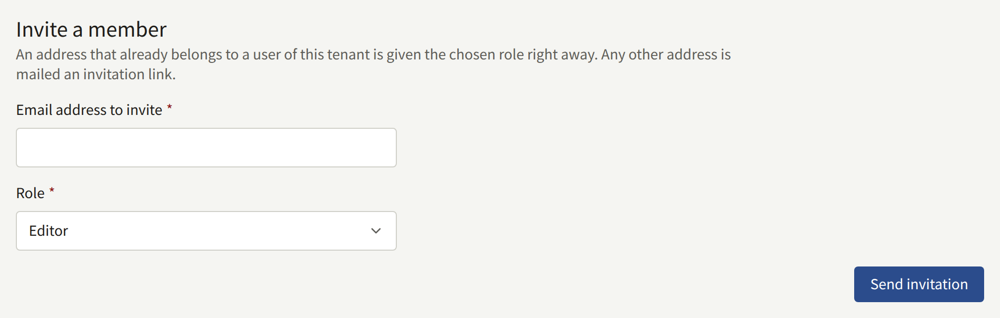
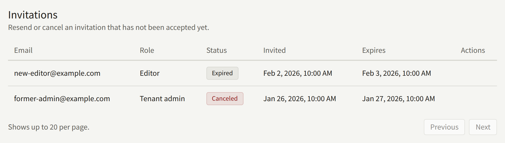
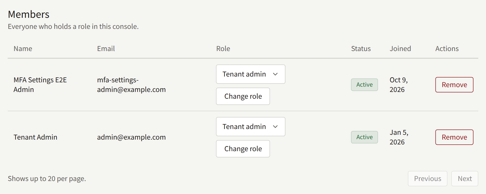

**Members**, under **Administration**, lists everyone who can sign in to this console, and is where a Tenant admin brings staff in, changes their roles, and takes them out again. Only a Tenant admin sees it.

A member of staff is an account on the tenant's site that also holds a console role. Staff sign in to the console with the same email address and password they use on the site, and taking someone's role away leaves their account on the site as it was. [A tenant's staff](../../3-operations/3-tenant-staff.md#members-and-users) explains this from the operator's side.

## The roles

| Role | What it may do |
| --- | --- |
| **Tenant admin** | Everything in the console, this screen included |
| **Editor** | The catalog, the site's pages and announcements, and comment moderation |
| **Auditor** | See what an Editor works on, and the tenant's settings, without changing any of it |

[Tenant console](../index.md#roles) lists what each role covers. Keep the number of Tenant admins small: a Tenant admin can replace the tenant's payment and mail credentials, suspend and delete its readers' accounts, and change its staff.

## Inviting a member

Under **Invite a member**, enter the address in **Email address to invite**, choose its **Role**, and choose **Send invitation**. The role starts at **Editor**, so choose **Tenant admin** deliberately when that is what the person needs.

- **An address with no account on the site** is mailed an invitation to the chosen role, in the tenant's default language. The link in it leads to this console, where the invitee enters their **Full name** and a **Password** and chooses **Accept invitation**. They then sign in with that role. The link is valid for 24 hours.
- **An address that already has an account on the site** is given the role at once, and no mail is sent. An account that already holds a role can be made a Tenant admin this way, which replaces its role; for any other role the console refuses it and points to **Members**, where the role is changed as described below.

**Invitations** lists each invitation with the **Role** it grants, as **Pending**, **Accepted**, **Canceled**, or **Expired**. On a pending one, **Resend** mails it again with a new link, valid for another 24 hours, and **Cancel invitation** withdraws it. Either way the earlier link stops working. To try again after an invitation has expired or been canceled, or to change the role a pending one grants, invite the same address again with the role it should have.

An invitation is mailed by the platform's mail server unless the tenant sends through its own, as [Email](./6-email.md) describes. If one does not arrive, check the invitee's spam folder, then the tenant's mail settings.

## Changing a role

In **Members**, choose the new role in the member's **Role** column and choose **Change role**. The change applies to the member's next action in the console, including in a console they already have open.

## Removing a member

**Remove** on a member's row, confirmed with **Remove**, takes every role from them. They are shut out of the console from their next action. Their account stays on the site as a reader's, with their purchases and history.

To take away their reading too, suspend or delete the account from their page under **Readers**, which the member's name in the list links to. [Readers](../2-readers.md#readers) describes what each of the two leaves in place.

## The last Tenant admin

The console refuses to demote or remove the tenant's last active Tenant admin, yourself included, so that someone can always manage the staff. Make someone else a Tenant admin first.

If the last Tenant admin leaves the publisher or loses access to their account anyway, the operator can give the role to someone else, as [Recovering a tenant with no administrator](../../3-operations/3-tenant-staff.md#recovering-a-tenant-with-no-administrator) describes.

## What is recorded

Every invitation, resend, cancellation, acceptance, role change, and removal is recorded in the [audit log](./7-audit-log.md), with the Tenant admin who made it. An invitation, its resend and acceptance, and a role change also record the role they grant.
