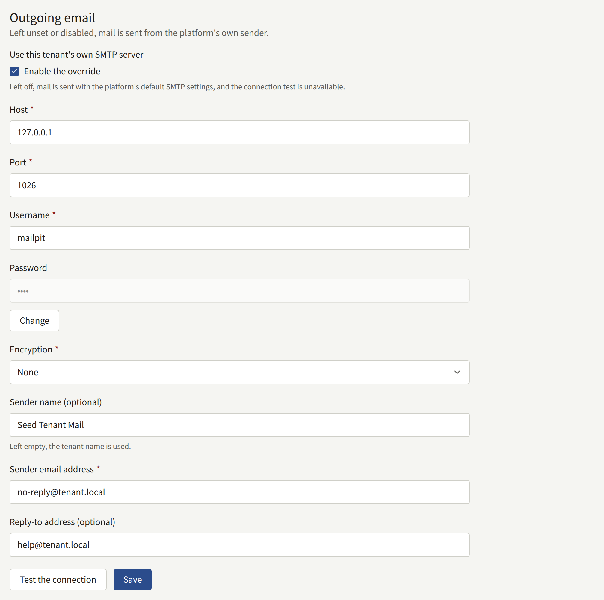
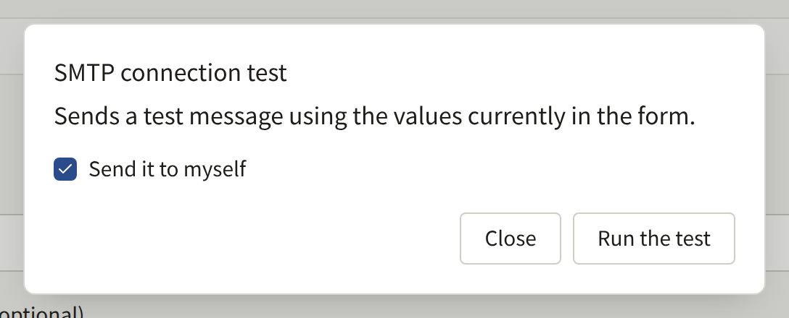
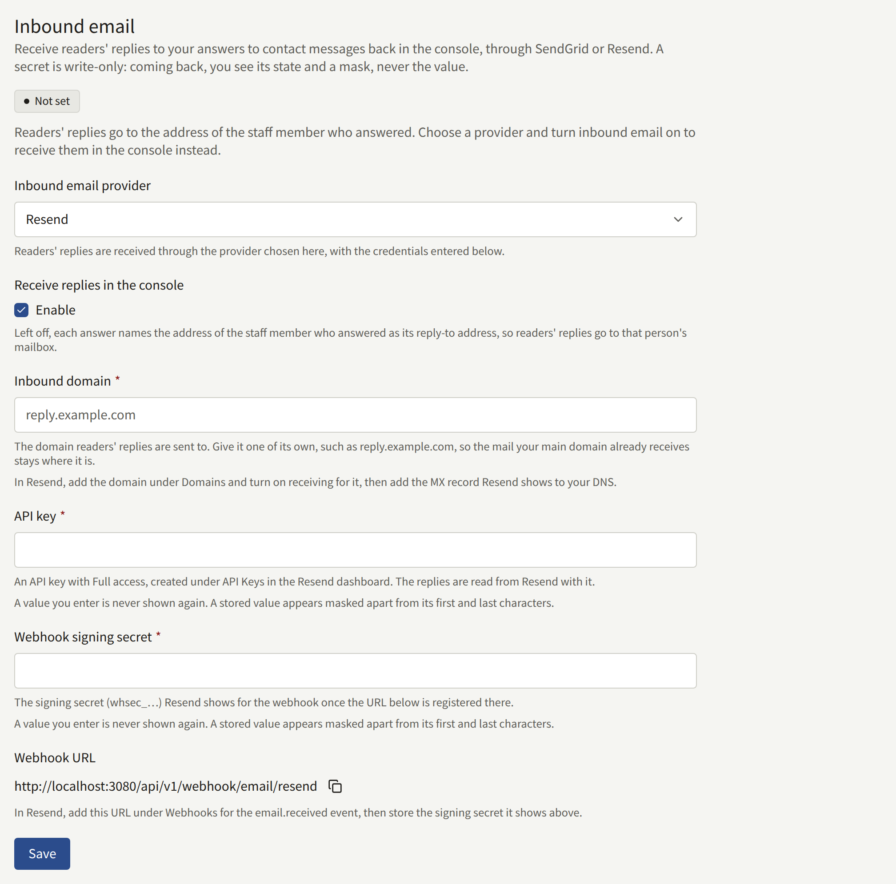

The tenant sends mail to its readers and its staff: address confirmations, password resets, invitations, replies to contact messages. Until a Tenant admin sets up a server of the tenant's own, all of it goes out through the platform's mail server, from the platform's address, which the operator chooses. **Integrations** › **Email** sends it through the publisher's own SMTP server instead, from an address on the publisher's domain.

Only a Tenant admin sees this screen. There is nothing for the operator to allow first.

## What goes through it

With the tenant's own server turned on, it sends every mail the tenant sends:

- To readers: the sign-up confirmation, password resets and the notice that a password changed, email address change confirmations and the notice that an address changed, and the notice that someone tried to sign up with an address that already has an account.
- Replies to readers' contact messages.
- To staff: invitations to new Tenant admins, the console's password resets and email address changes, and the notice of a new contact message.

The tenant sends no purchase receipts. Announcements and other notices reach readers on the site and in the app, not by mail.

## Before you start

Have these from whoever runs the publisher's mail:

- The SMTP server's host name and port, and whether it expects TLS from the start of the connection (usually port 465) or STARTTLS (usually port 587).
- A username and password for it.
- The address the mail should come from, which the server is allowed to send as. Have the domain's SPF and DKIM records cover the server, or readers' mail services are likely to file the tenant's mail as spam.

## Setting it up

1. Open **Integrations** › **Email** and, in the **Outgoing email** section, tick **Enable the override** under **Use this tenant's own SMTP server**. The fields below it open.
2. Fill in:
   - **Host** and **Port**.
   - **Username** and **Password**.
   - **Encryption**: **TLS**, **STARTTLS**, or **None**. **TLS** and **STARTTLS** both require TLS 1.2 or later, and **STARTTLS** fails rather than sending in the clear when the server does not offer it. Choose **None** only for a server that is reached over a private network.
   - **Sender email address**: the address the mail comes from, such as `noreply@comics.example.com`.
   - **Sender name (optional)**: the name readers see beside that address, usually the site's name. Left empty, the tenant's name is used, both for the tenant's mail and for the connection test.
   - **Reply-to address (optional)**: where a reader's reply goes, such as a support address. Left empty, replies go to the sender address. A reply to a contact message keeps its own reply-to address instead.
3. Choose **Test the connection**, then **Run the test**. The test sends a message through the values in the form, without saving them, to your own address, or to another one if you clear **Send it to myself**. A failed test says which step failed where it can tell: connecting, TLS or STARTTLS, signing in, the server refusing the recipient, or the server taking too long to answer.
4. Choose **Save**. The next mail the tenant sends goes through the new server.

A saved password is never shown again. The field shows that one is stored, and **Change** replaces it.

## When it stops working

Once the tenant's own server is on, its mail does not fall back to the platform's server. If the server refuses a mail or cannot be reached, the platform keeps trying for a while, at growing intervals, and then gives up on that mail. Nothing in the console reports a failure. If readers say their confirmation or password reset mail does not arrive, run **Test the connection** again with the saved settings.

To go back to the platform's mail server, clear **Enable the override** and choose **Save**. The rest of the settings are kept for when you turn it on again.

Every save is recorded in the [audit log](./7-audit-log.md) as **Email settings updated**, and every test, successful or not, as **SMTP connection tested**. The operator's side of the tenant's mail is described in [Email](../../3-operations/6-email.md#a-tenants-own-smtp-account).

## Readers' replies to contact messages

An answer to a contact message reaches the reader by mail. Until the tenant receives mail of its own, the answer's reply-to address is the address of the staff member who answered, so a reader who writes back reaches that person's mailbox and the console never sees the reply. The **Inbound email** section of **Integrations** › **Email** brings those replies back into the console, under the message they answer, through SendGrid or Resend.

### Before you start

- An account with SendGrid or Resend.
- A domain for replies whose DNS you can change, such as `reply.comics.example.com`. Its MX record will point at the provider, so mail sent to it reaches no other mailbox. A subdomain of its own keeps the mail the publisher's main domain already receives where it is.
- The site reachable from the internet: the provider posts each reply to the site's own domain. An IP allowlist, a sign-in prompt, or a bot challenge in front of the site has to let these requests through, as [Webhooks](../../2-deployments/4-reverse-proxy.md#webhooks) describes for the operator.

### Setting it up

1. Open **Integrations** › **Email**. In the **Inbound email** section, choose the provider under **Inbound email provider**, tick **Enable** under **Receive replies in the console**, and enter the reply domain as **Inbound domain**.
2. Set up the provider. The section shows a **Webhook URL** on the site's domain, with a button to copy it.
   - **SendGrid**: make up a long random string and enter it as **Webhook token**. In your DNS, point the domain's MX record at `mx.sendgrid.net` with priority 10. In SendGrid, add the domain under **Settings** › **Inbound Parse** with the **Webhook URL** as the destination URL, putting the token in place of `<token>`: SendGrid signs nothing, so the token in the URL is how the site tells its requests from anyone else's.
   - **Resend**: create an API key with **Full access** under **API Keys** and enter it as **API key**; replies are read from Resend with it. Add the domain under **Domains**, turn on receiving for it, and add the MX record Resend shows to your DNS. Under **Webhooks**, add the **Webhook URL** for the `email.received` event, and enter the signing secret Resend shows for it (`whsec_…`) as **Webhook signing secret**.
3. Choose **Save**. The section turns **Ready** and shows the **Reply address**, `contact+*@` followed by the domain: each answer from then on asks the reader to reply to an address of that form, where `*` is the message's ID, and the reply appears under that message.

Until the section is **Ready**, answers keep the answering staff member's address, and the section says so. **Not set** means nothing is stored; **Disabled** means the settings are stored but **Enable** is cleared; **Incomplete** means it is enabled but the domain or a credential the provider needs is missing.

The tokens and keys are never shown again once saved: each field shows a mask, and **Change** replaces it. Saving with another provider chosen deletes the credentials stored for the previous one.

To stop receiving replies, clear **Enable** and choose **Save**. The next answer names the staff member's address again, and the settings are kept for when you turn it back on. Every save is recorded in the [audit log](./7-audit-log.md) as **Inbound email settings updated**.
