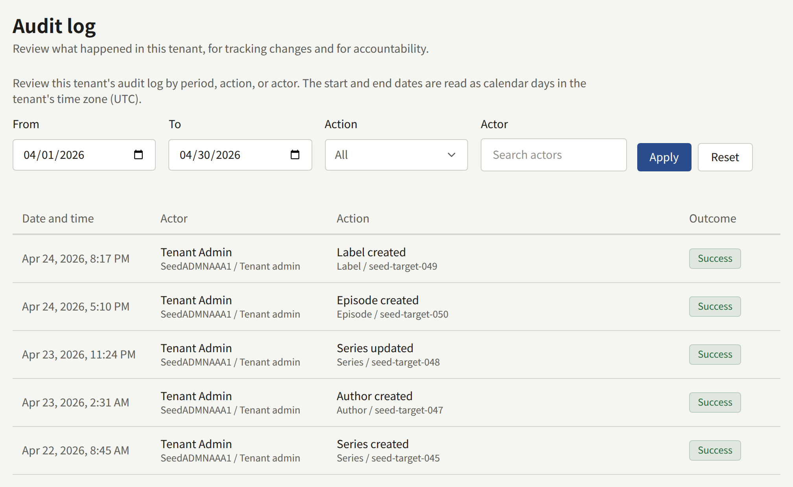

**Audit logs**, under **Administration**, is the tenant's record of what its staff did in the console: who changed what, when, and whether it worked. It answers questions such as who suspended a reader, who changed the payment settings, or when a member was given a role. Only a Tenant admin sees it.

## Reading the log

Each entry shows:

- **Date and time**, in the tenant's time zone.
- **Actor**: the member of staff, with their public ID and the role they held at the time. **Automatic** marks an action the platform took on its own, such as a comment hidden because enough readers reported it.
- **Action**, with the kind and ID of what it acted on underneath, and a reason when the action records one.
- **Outcome**: **Success** or **Failure**. A failed attempt is recorded too, such as a wrong code at a two-step verification sign-in or a mail server test that did not get through.

The newest entries come first, 20 to a page. To narrow the list, set **From** and **To**, which are whole days in the tenant's time zone, an **Action**, or an **Actor**, and choose **Apply**. **Reset** clears them.

The log cannot be exported, and its entries are never deleted. An entry keeps the name and public ID of a member of staff whose account has since been deleted.

## What is recorded

| Area | Recorded |
| --- | --- |
| Catalog | Series, episodes, Authors, Author roles, labels, and genres created and changed, Author roles and genres deleted, their images uploaded, and free reading periods and Free if you wait changed |
| Site | Pages created and changed, their versions created, published, and rolled back, their translations added and deleted, pages unpublished, announcements created, and banners taken down |
| Comments | Comments approved, removed, restored, and purged, removals made automatically after reports, and reports upheld or dismissed |
| Readers | Readers suspended, restored, and deleted, their dates of birth changed or cleared, and access tickets issued and revoked. Contact messages handled, reopened, assigned, annotated, and answered |
| Royalties | Closing settings changed, months closed, and statements downloaded as CSV |
| Staff | Members invited, invitations resent, canceled, and accepted, roles changed, and members removed |
| Settings and integrations | The mail settings and their tests, the payment provider's settings, the mobile push credentials, the sign-in providers, community limits, retention periods, and refused email addresses |
| Two-step verification | Staff setting it up, turning it off, regenerating recovery codes, and signing in with it or with a recovery code |

Some changes leave no entry yet ([#3797](https://github.com/publira/publira/issues/3797)): anything under **Branding**; on the **General** tab of **Settings**, the public site display, the time zone, the default language, reader comments, age verification, and the choice of terms of service and privacy policy; and under **Integrations**, **Where episodes are sold** on **Payments** and the apps named under **App links**. Nor does a member changing their own email address, or anything readers do on the site.

What the operator changes for the tenant from the Platform Console or `publiractl`, such as its domain or an administrator's role, is recorded in the Platform Console's own log, not this one.
