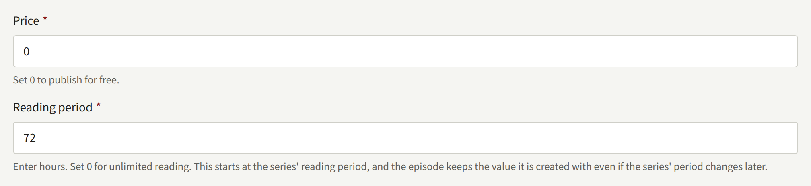
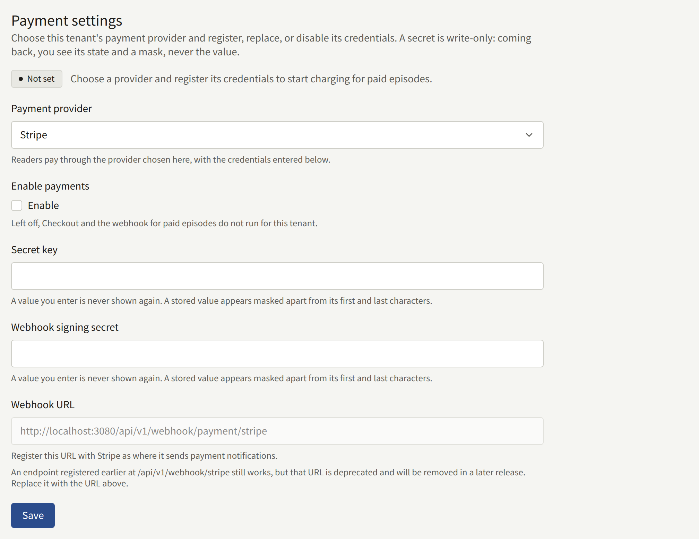
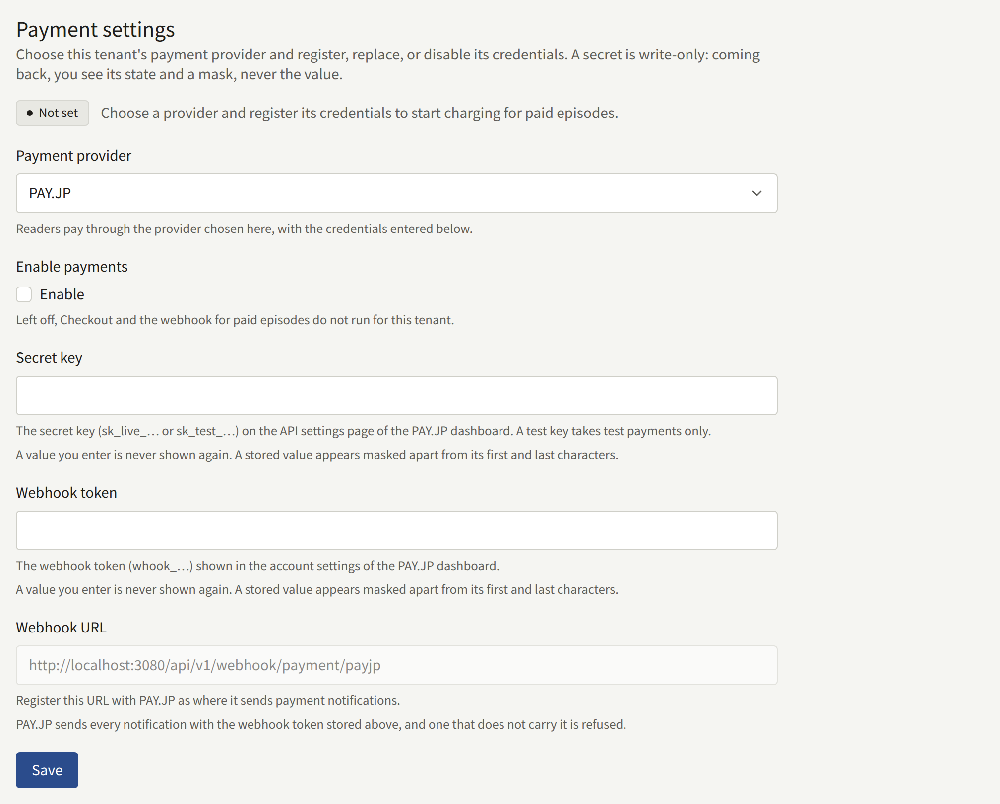
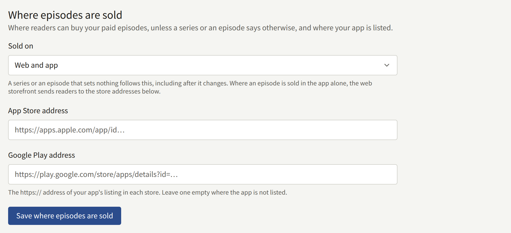
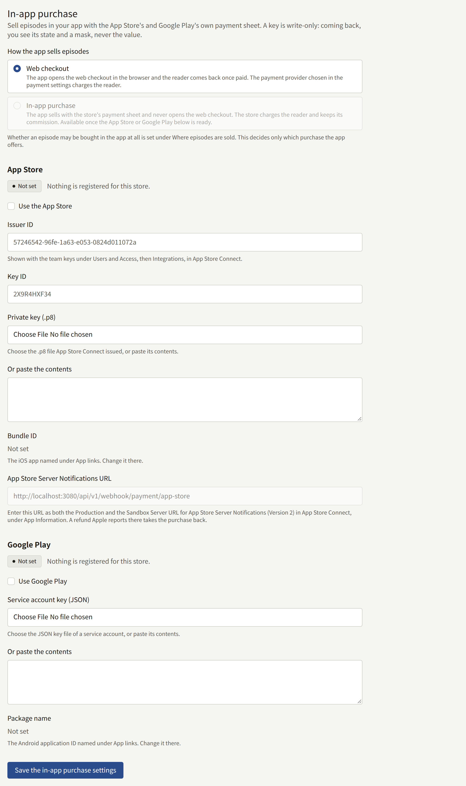
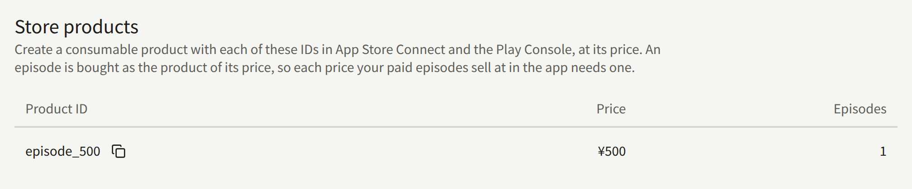

Selling an episode on the site takes three things that have to agree: the episode's price in the tenant console, an account with a payment provider, and a webhook through which the provider tells the install that a reader has paid. The provider charges the reader, but only the webhook opens the episode, so a setup with any of the three wrong takes the reader's money and leaves the episode locked. This page walks through all three, in the order they are set up, and ends with a test purchase that proves they agree.

The tenant's app sells either through the same provider, or through the App Store's and Google Play's own payment, which needs no provider and is verified with the stores instead. [Selling in the app](#selling-in-the-app) covers that choice, and a tenant that sells only in its app through the stores can skip the provider sections.

Everything here under **Integrations** › **Payments** is for a **Tenant admin**; an Editor or an Auditor does not see that screen. Pricing an episode is done by whoever creates it.

## How a reader buys an episode

### Price and reading period

An episode's **Price** and **Reading period** are first entered on the form that creates it:

- **Price** is a whole number of yen. `0` makes the episode free; any other value makes it a paid episode.
- **Reading period** is how many hours a purchase keeps the episode open. `0` keeps it open with no end.

Both can be changed later under **Price and reading period** on the episode's edit screen, as [Episodes](./1-catalog/2-episodes.md#changing-the-price-and-reading-period) describes. A change applies to purchases made after it is saved; a purchase already made keeps the price it was paid and the time it expires. A new episode's **Reading period** starts at the series' **Reading period**, so setting it on the series once gives every episode created afterwards the same period unless it is changed on the form. Changing the series' period does not reach the episodes already created.

### Buying and reading

On a paid episode the site shows the price and **Buy this episode**. A reader who is signed in and chooses it is sent to the payment provider's checkout page, pays there, and comes back to the episode, which tells them their payment is being confirmed. The episode opens when the provider's notification of the payment reaches the install, usually within seconds. Coming back from the checkout page opens nothing by itself.

Once bought, the episode:

- Stays open for its reading period, counted from the moment the purchase is recorded.
- Is listed under **Purchases** on the reader's account, and after its reading period ends, under **Purchase history**.
- Opens on the site and in the tenant's app alike, for the same account, wherever it was bought.
- Cannot be bought again while it is open. Once its reading period has ended, it can.

### Free reading periods and Free if you wait

A price is what a reader pays when nothing else opens the episode. Two other things can, and while either has the episode open to a reader, the site offers that reader no purchase:

- **Free reading periods**, set on an episode, open it to everyone, signed in or not, between two dates. The price applies again when the period ends. A reader who bought the episode earlier keeps their purchase, and its reading period keeps running through the free period.
- **Free if you wait**, set on a series, gives each signed-in reader a free ticket that opens one paid episode of the series for **Hours an episode stays open**, and a new ticket **Hours until the next ticket** after they use one. **Newest episodes a ticket cannot open** keeps the latest episodes for buyers. A ticket cannot be used on an episode in a free reading period, or on one the reader already has.

An [access ticket](./2-readers.md#access-tickets), issued by staff under **Access tickets**, opens an episode the same way, without payment. An Author credited on an episode reads it free and is not offered a purchase.

## Choosing a payment provider

A tenant takes payment on the site through one provider at a time, chosen under **Payment settings** on **Integrations** › **Payments**:

| Provider | What a reader can pay with |
| --- | --- |
| Stripe | The payment methods turned on for your account in the Stripe Dashboard, such as cards and konbini. An episode bought with a method that is paid later, such as konbini, opens once the payment arrives. |
| PAY.JP | Cards, with 3-D Secure authentication on every payment. |

Payments are taken in yen with either provider.

The status beside the form says where the setup stands:

- **Not set**: no provider has been chosen.
- **Incomplete**: payments are on, but a credential the provider needs is missing, so nothing is charged.
- **Disabled**: the credentials are stored, but **Enable payments** is off.
- **Ready**: readers can buy.

Until it is **Ready**, a paid episode shows its price with no way to buy it, and tells readers that the site cannot take purchases at the moment. Choosing another provider and saving deletes the credentials stored for the previous one.

Do the setup below with the provider's test keys first, as [Testing before going live](#testing-before-going-live) describes, and replace them with live keys once a test purchase has gone through.

### Stripe

In the Stripe Dashboard:

1. Copy the **secret key** from the API keys page. A test key starts with `sk_test_`, a live key with `sk_live_`.
2. Add a webhook endpoint. Its URL is the **Webhook URL** the console shows under **Payment settings** once Stripe is chosen, `https://<tenant-domain>/api/v1/webhook/payment/stripe` on the tenant's own site domain. Select these three events:
   - `checkout.session.completed`
   - `checkout.session.async_payment_succeeded`
   - `charge.refunded`
3. Open the endpoint and copy its **signing secret**, which starts with `whsec_`.

Then in the console, under **Payment settings**:

1. Choose Stripe as the **Payment provider**.
2. Enter the **Secret key** and the **Webhook signing secret**.
3. Under **Enable payments**, check **Enable**, and choose **Save**.

Stripe keeps test-mode and live-mode webhook endpoints apart, each with its own signing secret. When you move to live keys, add the endpoint again in live mode, and enter its signing secret together with the live secret key.

An endpoint registered before at `/api/v1/webhook/stripe` still receives notifications, but that URL will be removed in a later release; replace it with the URL the console shows.

### PAY.JP

In the PAY.JP dashboard:

1. Copy the **secret key** from the API settings page. A test key starts with `sk_test_`, a live key with `sk_live_`, and a test key takes test payments only.
2. Copy the **webhook token**, which starts with `whook_`, from the account settings.
3. Register the **Webhook URL** the console shows under **Payment settings** once PAY.JP is chosen, `https://<tenant-domain>/api/v1/webhook/payment/payjp`, as the URL PAY.JP sends its notifications to. Register it for live mode as well before going live.

Then in the console, under **Payment settings**:

1. Choose PAY.JP as the **Payment provider**.
2. Enter the **Secret key** and the **Webhook token**.
3. Under **Enable payments**, check **Enable**, and choose **Save**.

PAY.JP signs nothing: the install trusts a notification because it carries the webhook token, and refuses one that does not, so keep the token as secret as the secret key.

### When a payment does not open the episode

The provider's dashboard lists each delivery to the webhook with the status the install answered. Each status points to one cause:

| Status | Cause | What to do |
| --- | --- | --- |
| 2xx | Accepted. Not every accepted notification opens an episode: Stripe sends `checkout.session.completed` for a konbini payment before the reader pays, and the episode opens only with the `checkout.session.async_payment_succeeded` that follows the payment | Check the event type and the payment's status in the dashboard. If the payment is complete and the episode is still locked, the reader may have bought it on another account. |
| 400 | The signing secret or webhook token in the console does not match the provider's | Enter the value from the endpoint the provider is sending from. |
| 404 | The path does not name a provider | Register the URL exactly as the console shows it. |
| 503 | Payments are not **Ready**, or the URL names a provider other than the one chosen | Finish the setup above. The provider retries the delivery. |
| No delivery | The webhook is not registered, or is registered for the other mode | Register it in the mode the keys belong to. |

Both providers retry a failed delivery for some time, and their dashboards can resend one. Once the setup is fixed, a payment whose notification arrives opens the episode it paid for.

## Where episodes are sold

**Where episodes are sold**, on the same screen, decides where a reader can buy a paid episode. **Sold on** offers:

- **Web and app**: on the site and in the tenant's app.
- **Web only**: on the site. The app shows the episode as sold on the website, and opens it once it is bought there.
- **App only**: in the app. The site shows the episode as sold in the app, opens it to a reader who bought it there, and links to the app's listing in each store under **App Store address** and **Google Play address**.

A series or an episode can set its own **Sold on**, and one that sets nothing follows the series, or the tenant, including after either changes. An episode is sold only where it is also shown.

The choice exists because of the app stores. Apple and Google each set rules on how an app may sell digital content, decide in review whether an app follows them, and take a commission on what the app sells through them. A tenant whose app sells through the stores' own payment, as the next section describes, pays that commission on every episode bought in the app, and can keep a series on the site alone with **Web only**. A tenant with no app, or one that does not sell in its app, chooses **Web only** for every episode.

## Selling in the app

The **In-app purchase** section decides how the tenant's app sells an episode it may sell, under **How the app sells episodes**:

- **Web checkout** opens the site's checkout in the phone's browser, through the provider above, and brings the reader back to the episode once paid.
- **In-app purchase** sells with the App Store's and Google Play's own payment sheet. The store charges the reader and keeps its commission, and the payment provider above is not involved.

With **In-app purchase**, the app needs no payment provider from [Choosing a payment provider](#choosing-a-payment-provider): it buys through the store and the install verifies the purchase with the store.

On an episode sold **App only**, the site shows the episode as sold in the app and links to the stores only while the app can sell it: with **Web checkout**, while a payment provider is **Ready**; with **In-app purchase**, while a store is **Ready**, and then only to the listing of a store that is. Until then the site quotes the episode's price and tells readers it cannot take purchases. An episode sold **Web and app** is bought on the site while a payment provider is **Ready**; while none is and the app can sell it, the site treats it the same way as one sold **App only**.

**In-app purchase** can be chosen once at least one store is **Ready**: turned on with **Use the App Store** or **Use Google Play**, with its key entered, and with its app named under **Integrations** › **App links**.

The app buys each episode as the store product named after its price, such as `episode_300` for a ¥300 episode, so a store sells only the prices it has a product for. **Store products**, at the bottom of the screen, lists the product ID every price your app sells at needs. Create each one in App Store Connect and in Play Console as a consumable product at that price, and add one whenever a new price appears in the list.

What each store needs, from the key the install verifies purchases with to testing with the stores' test buyers, is on [In-app purchase and sign-in](../5-mobile-app/5-purchases-and-sign-in.md#selling-episodes-in-the-app), with the app's own setup. A purchase from the App Store sandbox or a Play license tester opens the episode but is recorded as a test, and left out of royalty statements and the content statistics.

## Refunds

A refund is made where the reader paid: in the Stripe or PAY.JP dashboard for a purchase on the site, and by Apple or Google for a purchase in the app. Nothing is done in the console, and Publira does not tell the reader.

- **A full refund** closes the episode to the reader. The purchase stays in their history, and they can buy the episode again.
- **A partial refund** leaves the episode open until the refunds on the payment add up to its price. It still lowers the sales the episode's Authors are paid royalties on.

Each refund reaches the install the way its purchase did:

- **Stripe and PAY.JP** report it through the webhook above, which is why Stripe's endpoint needs `charge.refunded`.
- **The App Store** reports it to the **App Store Server Notifications URL** the console shows in the **App Store** section, which is registered in App Store Connect as both the Production and the Sandbox Server URL.
- **Google Play** does not send refunds. The install reads Google Play's voided purchases once an hour, for the last 30 days, so a refunded purchase can keep its episode open for up to an hour. This runs in `publira worker`, which the operator keeps running, as [Overview](../2-deployments/1-overview.md) describes; without it, Google Play refunds are not applied.

A refund that arrives before the purchase it reverses is kept, and applied when the purchase is recorded.

## Testing before going live

Test the whole setup with the provider's test keys before readers can pay: the webhook is the part that most often goes wrong, and only a purchase shows that it works.

A purchase made in the provider's test mode opens the episode but is recorded as a test, and left out of royalty statements and the content statistics. The console cannot delete an episode, so keep the test in a series of its own, which you hide afterwards.

1. Set up the provider with its **test** secret key, and register the webhook in test mode, as above. Check that **Payment settings** shows **Ready**.
2. Create a series for the test, shown on **Web and app** or **Web only** and published now. In it, create an episode with a **Price** such as `100` and a **Reading period** such as `1`, published now, and sold on the web.
3. On the site, sign in with a reader account that holds no console role, open the episode, and choose **Buy this episode**.
4. Pay with a test card. `4242 4242 4242 4242`, with any future expiry date and any three-digit security code, works with both providers. PAY.JP then shows its test 3-D Secure screen, where you choose the outcome.
5. Back on the episode, wait for it to open, then check that it is listed under **Purchases**. If it does not open within a minute, read the delivery in the provider's dashboard, as [When a payment does not open the episode](#when-a-payment-does-not-open-the-episode) describes.
6. Refund the payment in full from the provider's dashboard, which proves that refunds reach the install too. Reload the episode: it is locked again, and **Buy this episode** is back.

When both pass, set the test series' **Shown on** to **Not shown anywhere**. Then replace the test secret key with the live one, register the webhook in live mode, enter its signing secret or token, and save.

To test in-app purchase, use the stores' own test buyers as [Testing a purchase](../5-mobile-app/5-purchases-and-sign-in.md#testing-a-purchase) describes. Those purchases are recorded as tests as well.
